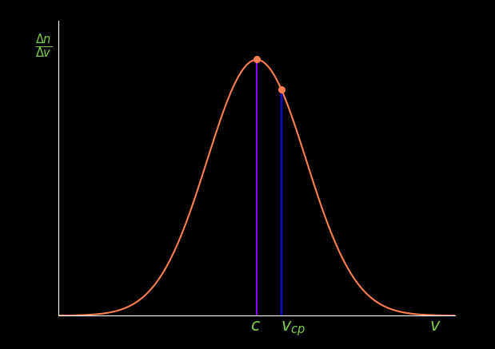

# Моделирование физических процессов

## Содержание

+ [Введение](#Введение)
+ [Компьютерное моделирование и языки программирования](#Компьютерное-моделирование-и-языки-программирования)
+ [Глава I. Моделирование частиц в поле силы тяжести](#Глава-I-Моделирование-частиц-в-поле-силы-тяжести)
    + [1.1 Распределение частиц в поле силы тяжести](##11-Распределение-частиц-в-поле-силы-тяжести)
    + [1.2 JavaScript и Canvas](##12-JavaScript-и-Canvas)
    + [1.3 Создание модели](##13-Создание-модели)
+ [Глава II. Моделирование броуновского движения](#Глава-II-Моделирование-броуновского-движения)
    + [2.1 Броуновское движение](##21-Броуновское-движение)
    + [2.2 Используемые модули](##22-Используемые-модули)
    + [2.3 Создание модели](##23-Создание-модели)
+ [Глава III. Моделирование распределения молекул по скоростям](#Глава-III-Моделирование-распределения-молекул-по-скоростям)
	+ [3.1 Распределение Максвелла-Больцмана](##31-Распределение-Максвелла-Больцмана)

## Введение

Компьютерное моделирование – это процесс создания математических моделей реальных систем с использованием компьютерных программ. Оно позволяет исследовать поведение и изменения объектов в различных условиях, а также предсказывать их будущее поведение. Компьютерное моделирование широко используется в науке, инженерии, экономике, медицине и других областях. В настоящее время компьютерное моделирование физических процессов является одним из самых важных инструментов в научных и технических исследованиях. С его помощью можно проводить эксперименты, которые были бы невозможны или слишком дорогостоящими в реальном мире. Кроме того, моделирование позволяет ускорить процесс разработки новых технологий и устройств, а также оптимизировать уже существующие.

Цель данного дипломного проекта заключается в изучении основных методов компьютерного моделирования физических процессов и их применении на практике. Для достижения этой цели будут использованы различные программные средства. В работе будет рассмотрено моделирование различных физических процессов, включая распределение Максвелла-Больцмана, распределение частиц в поле силы тяжести, броуновское движение.

## Компьютерное моделирование и языки программирования

Одним из наиболее распространенных языков программирования для моделирования является MATLAB. Этот язык используется для решения математических задач, анализа данных и создания графиков. MATLAB имеет большое количество встроенных функций и инструментов для работы с матрицами и векторами, что делает его очень удобным для создания математических моделей.

Другим популярным языком программирования для компьютерного моделирования является Python. Python – это интерпретируемый язык программирования, который используется для разработки программного обеспечения, анализа данных и машинного обучения. Он имеет простой и понятный синтаксис, что делает его доступным для начинающих программистов. Также можно выделить C++, C# Java, JavaScript и др. Каждый из этих языков имеет свои преимущества и недостатки в зависимости от задачи, которую нужно решить.

Кроме языков программирования, для компьютерного моделирования используются специализированные программные средства, такие как Simulink, ANSYS, COMSOL и др. Эти программы предоставляют готовые блоки для создания математических моделей и имеют широкий набор инструментов для анализа результатов моделирования.

## Глава I. Моделирование частиц в поле силы тяжести

### 1.1 Распределение частиц в поле силы тяжести

Если в жидкости находятся в большом количестве маленькие частички, более тяжелые, чем жидкость, и не растворяющиеся в ней, то на первый взгляд может показаться, что рано или поздно эти частицы должны опуститься на дно. Это, однако, неверно, — так было бы, если бы отсутствовало тепловое движение.
Действительно, сила тяжести тянет частицы вниз, однако хаотическое тепловое движение, являющееся неотъемлемым свойством любых частиц, будет непрерывно препятствовать действию силы тяжести. Частица движется вниз, но по дороге может испытать столкновение, которое отбросит ее кверху; опять начнется движение вниз и опять столкновение может отбросить частицу вверх или в сторону. Если какой-то частице удалось добраться до дна сосуда, то случайными ударами другая частица может быть поднята со дна и случайными толчками может быть доведена до высоких слоев жидкости. Вполне понятно, что в результате установится некоторое неравномерное распределение частиц. В верхних слоях частиц будет меньше, ближе ко дну сосуда — больше всего. Чем тяжелее частицы и чем меньше температура, тем больше будет «прижато ко дну» распределение частиц по высоте.
Количественная сторона этого интересного явления, которое имеет место для любых частиц, расположенных в поле тяжести (молекул газа или частиц эмульсии, взвешенных в газе или жидкости), освещается законом Больцмана. Экспоненциальный множитель в формуле распределения Больцмана перепишем в виде

$$ e ^ { - { mv^2 \over 2kT }} e ^ {- { mgh \over kT }} $$

вместо потенциальной энергии тяготения $U$ мы подставили в выражение $mgh$. Нас интересует число всех молекул (любых скоростей), находящихся на высоте между $h$ и $ {h+ \Delta h}$. Оно будет равно

$$ \Delta n = n_0e^{-{ mgh \over kT }} \Delta h. $$

Здесь коэффициент пропорциональности $n_0$ по смыслу есть не что иное, как удельное число частиц при  ${\Delta n \over \Delta h }$ при ${ h = 0 }$. Из формулы видно, что быстрота убывания зависит от ускорения силы тяжести. На разных планетах частицы должны быть по-разному распределены с высотой.

Формула убывания числа частиц с высотой может быть записана для плотности газа или для давления газа. Так как давление газа пропорционально числу частиц в единице объема, то формулу можно переписать в виде

$$ p = p_0 e ^ {- { mgh \over kT }}. $$

### 1.2 JavaScript и Canvas

JavaScript $-$ это язык программирования, который широко используется для создания интерактивных веб-страниц. Одним из самых популярных приложений JavaScript является создание графики и анимации в вебе с использованием технологии Canvas.

Canvas - это мощный элемент HTML5, который позволяет разработчикам создавать динамическую, интерактивную графику на веб-страницах. С помощью Canvas можно рисовать фигуры, линии, текст и изображения, а также анимировать их в реальном времени. Это делает его идеальным инструментом для создания игр, диаграмм, визуализаций данных и других интерактивных веб-приложений.

Одним из ключевых преимуществ использования Canvas с JavaScript является то, что он позволяет быстро и плавно отображать графику, даже на мобильных устройствах. Это происходит потому, что Canvas использует аппаратное ускорение для рендеринга графики, что означает, что он использует GPU (графический процессор) устройства для выполнения вычислений и быстрого рисования графики.

### 1.3 Создание модели

Для работы с ```сanvas``` необходимо сперва задать тег в ```html``` документе.

```Html
<canvas id="canvas" width="700" height="700"></canvas>
```

Затем в ```JavaScript``` коде получить поле для рисования

```JavaScript
var canvas = document.getElementById('canvas');
var context = canvas.getContext('2d');
```

Параметры для описания частицы (радиус, цвет, масса, заряд, градиент) в данной модели определены в классе ```Ball```.
В целом анимация происходит следующим образом: функция ```Init()``` создает и инициализирует ```Ball object``` , задавая его положение и скорость, после чего отрисовывает его в поле ```canvas```. Дальше инициализируются переменные времени и вызывается функция ```animFrame()```, которая настраивает цикл анимации и вызывает ```onTimer()``` и ```move()``` . Функция ```onTimer()```  вычисляет прошедшее время (в секундах) с момента первого вызова, $dt$, а затем обновляет продолжительность времени от начала симуляции, $t$ (в секундах). Последнее вычисляется путем суммирования всех пройденных временных интервалов $dt$ до текущего момента. Функция ```onTimer()``` также содержит условный оператор, который вызывает функцию ```move()```, если общее время симуляции меньше заданной продолжительности ```animTime```, и вызывает функцию ```stop()``` в противном случае, которая завершает цикл анимации. Функция ```move()``` обновляет вектор позиции ```Ball object``` на основе вектора скорости, удаляет все в ```canvas``` и перерисовывает ```Ball object```.
Наличие столкновений между парами частиц в массиве проверяются в ```checkCollision()```. Для этого мы используем
```Vector2D.distance(vec1,vec2)``` статический метод, который вычисляет расстояние между двумя точками с
помощью векторов положения ```vec1``` и ```vec2```. Логика алгоритма обнаружения столкновений проста: если расстояние между центрами
двух частиц меньше или равно сумме их радиусов, это означает, что они столкнулись. Затем мы меняем местами скорости
двух частиц.

Результат моделирования:

<p align="center"></p>
<p align="center">Распределение частиц в поле силы тяжести</p>

## Глава II. Моделирование броуновского движения

### 2.1 Броуновское движение

Броуновское движение — непрерывное, беспорядочное движение малых частиц, взвешенных в жидкости или газе, происходящее под действием ударов молекул окружающей среды. Броуновское движение представляет собой одно из наиболее ярких и доступных наблюдению проявлений молекулярно-кинетической природы хаотического теплового движения атомов и молекул. 
Причина броуновского движения — тепловое движение молекул среды и отсутствие точной компенсации ударов, испытываемых частицей со стороны окружающих её молекул, т. е. броуновское движение обусловлено флуктуациями давления (флуктуации — это случайные отклонения физических величин от их средних значений). Удары молекул среды приводят частицу в беспорядочное движение: скорость её быстро меняется по величине и направлению. Если фиксировать положение частицы через небольшие равные промежутки времени, то построенная таким образом траектория оказывается чрезвычайно сложной и запутанной. Если промежуток наблюдения τ достаточно велик, чтобы силы, действующие на частицу со стороны молекул среды, много раз меняли своё направление, то средний квадрат проекции её смещения ($\overline{Δx^2}$) на какую-либо ось (в отсутствие других внешних сил) пропорционален времени τ (закон Эйнштейна):

$$ {(\overline {Δx^2} ) = 2Dτ }$$

где $D$ — коэффициент диффузии. В математике, а точнее в теории случайных процессов, броуновское движение (винеровский процесс) – это гауссовский процесс с независимыми приращениями, у которого математическое ожидание равно нулю, а среднеквадратичное отклонение равно $t$ $σ$.
Теория броуновского движения объясняет случайные движения частицы действием случайных сил со стороны молекул и сил трения. Случайный характер силы означает, что её действие за интервал времени $τ_1$ совершенно не зависит от действия за интервал $τ_2$, если эти интервалы не перекрываются. Средняя за достаточно большое время сила равна нулю, и среднее смещение броуновской частицы $(\overline{Δx})$ также оказывается нулевым.

### 2.2 Используемые модули

Для написания программы используются ```Python 3.11.2``` с модулями ```Pygame``` и ```Pymunk```, ```random```.
```Python``` — высокоуровневый язык программирования общего назначения с динамической строгой типизацией и автоматическим управлением памятью, ориентированный на повышение производительности разработчика, читаемости кода и его качества, а также на обеспечение переносимости написанных на нём программ. Язык является полностью объектно-ориентированным в том плане, что всё является объектами. 
```Pygame``` — набор модулей (библиотек) языка программирования ```Python```, предназначенный для написания компьютерных игр и мультимедиа-приложений. ```Pygame``` базируется на мультимедийной библиотеке ```SDL```.
```Pymunk``` — игровой физический движок.
Модуль ```random``` необходим для генерации псевдослучайных чисел.

### 2.3 Создание модели

Параметры атомов описаны в классе ```Atom```. Данный класс имеет такие поля как радиус, скорость, масса, плотность, упругость, форму, начальную позицию и координаты.

```Python
class Atom():
	def __init__(self,x,y):
		self.x=x
		self.y=y 
		self.mass=1
		self.radius=8
		self.moment=pymunk.moment_for_circle(self.mass,0,self.radius)
		self.body=pymunk.Body(self.mass,self.moment)
		self.body.position=x,y 
		self.body.velocity=random.uniform(-100,100),random.uniform(-100,100)
		self.shape=pymunk.Circle(self.body,self.radius)
		self.shape.density=1
		self.shape.elasticity=1
		space.add(self.body,self.shape)

	def draw(self):
		x,y=self.body.position
		pygame.draw.circle(display,PURPLE,(int(x),int(y)),self.radius)
```

Класс имеет один метод, который в качестве параметра принимает объект класса ```Atom``` и с помощью его координат с радиусом  рисует фигуру на поверхности.  Отрисовка производится посредством встроенного в ```Pygame``` метода ```draw.circle()```.
Модель частицы описана в классе ```Particle```, который идентичен классу ```Atom```. Отличие двух классов заключается в значениях таких полей как радиус, масса, скорость и плотность. Здесь также присутствует метод класса ```draw()```, который принимает в качестве параметра объект класса ```Particle```.
Классы описывают модель одного атома или частицы вещества. Но нам нужно, чтобы этих частиц было много и вообще для начала их создать.
Данный процесс происходит в функции ```game()```, в которой создаются объекты всех вышеперечисленных классов, а также в функции ```game()``` находится главный цикл, который будет вызывать все методы для отрисовки физических объектов.
Функция ```game()``` не принимает никаких параметров на входе. В её реализации прописано создание списков объектов классов ```Atom```, ```Particle``` и ```Wall```. Списки генерируются с помощью механизма языка ```Python list comprehension```. Это нужно, чтобы происходила отрисовка не одной, а множества частиц на экране.

Результат моделирования:

<p align="center"></p>
<p align="center">Броуновское движение</p>

## Глава III. Моделирование распределения молекул по скоростям

### 3.1 Распределение Максвелла-Больцмана

Распределение молекул по скоростям, выведенное впервые теоретическим путем выдающимся, английским физиком Максвеллом, можно рассматривать как следствие закона Больцмана.
Число молекул, скорости которых лежат в интервале от $v_x$ до ${v_x+ \Delta v_x }$, от $v_y$ до ${ v_y+\Delta v_y}$ и от $v_z$ до ${v_z+\Delta v_z}$ , будет согласно закону Больцмана равно

$$ \Delta n = { Ce ^{-{mv^2 \over 2kT}}\Delta v_x, \Delta v_y, \Delta v_z}.$$

Подразумевается, что мы интересуемся распределением скоростей в небольшом объеме газа, а распределение молекул по координатам учитывается постоянным множителем $С$, который сейчас не представляет.для нас интереса.
Написанная формула учитывает распределение молекул как по величинам, так и по направлениям скоростей. Однако распределение по направлениям нам известно. Ведь числа молекул, летящих в том или ином направлении, должны быть одинаковы при полном хаосе в движении молекул. Нас интересует число всех молекул, независимо от их направления, имеющих скорость от $v$ до ${v+ \Delta v}$, где

$$ {v = {\sqrt{ v^2_x + v^2_y + v^2_z }}}.$$

Если построить трехмерный график, по осям которого откладывать проекции скоростей молекул ${v_x , v_y, v_z}$, разбить мысленно это пространство на бесконечно малые кубики объема ${ \Delta v_x\Delta v_y\Delta v_z }$, то можно наглядно представить себе данные о распределении скоростей молекул в виде чисел молекул, приходящихся на один кубик. Формула Больцмана и дает нам число молекул для каждого из кубиков.
Однако, всматриваясь в формулу, мы видим, что число молекул будет одинаковым для всех кубиков, попадающих внутрь шарового пояса с радиусом от $v$ до ${v+ \Delta v}$, — ведь в экспоненциальный множитель формулы входит лишь абсолютное значение скорости. Число молекул, обладающих скоростями в пределах от $v$ до ${v+ \Delta v}$, будет пропорционально объему шарового слоя, т. е. ${4 \pi v^2 \Delta v}$; таким образом, если число молекул, заключенных в одном кубике, равно

$$ { Ce ^{-{mv^2 \over 2kT}}\Delta v_x, \Delta v_y, \Delta v_z},$$

то число молекул, заключенных в шаровом поясе, т. е. обладающих скоростями в пределах от $v$ до ${v+ \Delta v}$, представится формулой

$$ \Delta n = { Ce ^{-{mv^2 \over 2kT}} 4 \pi v^2 \Delta v}.$$

При ${v=0}$ и ${v= \infty}$ число молекул обращается в нуль. Ясно, что кривая должна обладать максимумом. Обычными правилами найдем максимум множителя при ${\Delta v } $. Беря производную от этого выражения и приравнивая ее к нулю, получим

$${ {d \over dv} \left ( e ^{-{mv^2 \over 2kT}}\Delta v^2 \right) = 0},$$

откуда значение скорости, при которой функция распределения имеет максимум, равно

$${ c = \sqrt {2kt \over m}}.$$

Так как по оси ординат кривой распределения отложено число молекул, имеющих скорость $v$, то $с$ является своеобразным рубежом: молекулы, движущиеся со скоростями как большими, так и меньшими $с$, встречаются реже молекул, движущихся со скоростями $с$. Эта скорость называется наиболее вероятной.. Кривая распределения молекул газа по скоростям (распределения Максвелла) приведена ниже.

<p align="center"></p>
<p align="center">Рис.1. Распределение Максвелла</p>

Полезно сопоставить формулы наиболее вероятной скорости и средней квадратичной:

$${ c = \sqrt {2kt \over m}}, { v_{ср} = \sqrt {3kt \over m}}.$$

Средняя скорость больше вероятной. Причина ясна из вида кривой распределения: так как кривая распределения уходит далеко вправо, то туда же сдвинуты и средние значения скорости.
Приведем некоторые числа, характеризующие распределение скоростей газовых молекул. Число молекул со скоростями, близкими к наиболее вероятной $с$, больше числа молекул со скоростями, близкими к средней квадратичной, в 1,1 раза; больше числа молекул со скоростями, близкими к 0,5 $с$, в 1,9 раза; больше числа молекул со скоростями, близкими к 2 $с$, в 5 раз, см. рис. 1.