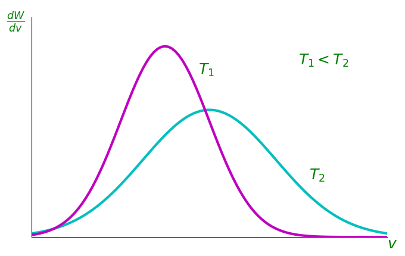
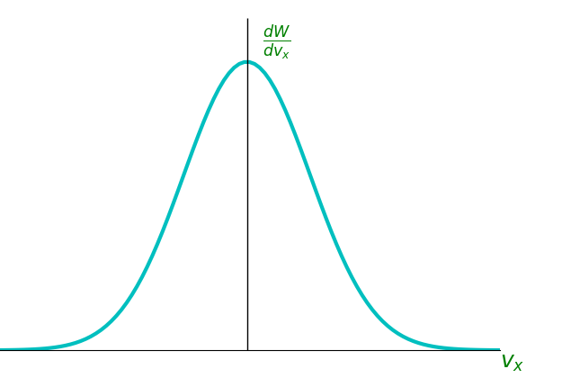
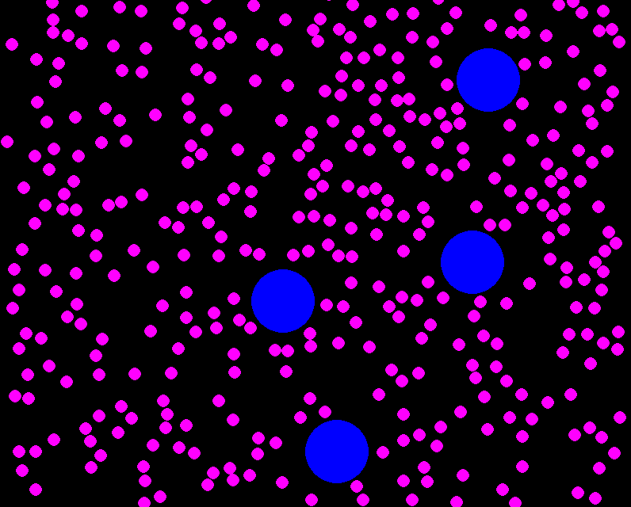

# КОМПЬЮТЕРНОЕ МОДЕЛИРОВАНИЕ МОЛЕКУЛЯРНО-КИНЕТИЧЕСКИХ ПРОЦЕССОВ

## Содержание

+ [ВВЕДЕНИЕ](#введение)
+ [ГЛАВА 1. ОПИСАНИЕ МОДЕЛИРУЕМЫХ ФИЗИЧЕСКИХ ЯВЛЕНИЙ](#глава-1-описание-моделируемых-физических-явлений)
  + [1.1 Распределение Максвелла-Больцмана](#11-распределение-максвелла-больцмана)
  + [1.2 Распределение Максвелла](#12-распределение-максвелла)
  + [1.3 Броуновское движение](#13-броуновское-движение)
+ [ГЛАВА 2. ИСПОЛЬЗУЕМЫЕ МОДУЛИ](#глава-2-используемые-модули)
  + [2.1 Компьютерное моделирование и языки программирования](#21-компьютерное-моделирование-и-языки-программирования)
  + [2.2 C++ и классы STL](#22-c++-и-классы-stl)
  + [2.3 JavaScript и Canvas](#23-javascript-и-canvas)
  + [2.4 Python и модули для визуализации данных](#24-python-и-модули-для-визуализации-данных)
+ [ГЛАВА 3. ОПИСАНИЕ ПРОЦЕССА МОДЕЛИРОВАНИЯ](#глава-3-описание-процесса-моделирования)
  + [3.1 Связь моделирования и симуляции. Имитация датчика температуры](#31-cвязь-моделирования-и-симуляциии-имитация-датчика-температуры)
  + [3.2 Моделирование распределения частиц в поле силы тяжести](#32-моделирование-распределения-частиц-в-поле-силы-тяжести)
  + [3.3 Моделирование распределения молекул по скоростям](#33-моделирование-распределения-молекул-по-скоростям)
  + [3.4 Моделирование броуновского движения](#34-моделирование-броуновского-движения)
  + [3.5 Результаты моделирования](#35-результаты-моделирования)
+ [ЗАКЛЮЧЕНИЕ](#заключение)
+ [СПИСОК ИСПОЛЬЗОВАННЫХ ИСТОЧНИКОВ](#список-использованных-источников)

## ВВЕДЕНИЕ

Компьютерное моделирование $–$ это процесс создания математических моделей реальных систем с использованием компьютерных программ. Оно позволяет исследовать поведение и изменения объектов в различных условиях, а также предсказывать их будущее поведение. Компьютерное моделирование широко используется в науке, инженерии, экономике, медицине и других областях. В настоящее время компьютерное моделирование физических процессов является одним из самых важных инструментов в научных и технических исследованиях. С его помощью можно проводить эксперименты, которые были бы невозможны или слишком дорогостоящими в реальном мире. Кроме того, моделирование позволяет ускорить процесс разработки новых технологий и устройств, а также оптимизировать уже существующие.

Цель данного дипломного проекта заключается в изучении основных методов компьютерного моделирования физических процессов и их применении на практике. Для достижения этой цели будут использованы различные программные средства. В работе будет рассмотрено моделирование различных физических процессов, включая распределение Максвелла-Больцмана, распределение частиц в поле силы тяжести, броуновское движение.

## ГЛАВА 1. ОПИСАНИЕ МОДЕЛИРУЕМЫХ ФИЗИЧЕСКИХ ЯВЛЕНИЙ

### 1.1 Распределение Максвелла-Больцмана

Если система находится в состоянии равновесия, то средние значения любых ее параметров не будут зависеть от времени. Поэтому функция распределения должна зависеть только от интегралов движения системы. Основным интегралом движения является полная механическая энергия системы $E$ или функция Гамильтона $H$. Соответсвенно простейший общий вид функции распределения будет $w(x)=w(H)$. Конкретный же вид этой функции $w(H)$ нужно определить. Функция Гамильтона зависит от $6N$ переменных системы $x$ и от внешних параметров $a$, т. е. $H(x,a)$. [12]

Для идеального газа функцию  Гамильтона $H(x,a)$ можно просто заменить энергией $E(x)$, тогда по формуле канонического распределения Гиббса для изотермической системы

$$w(x)=e^{\frac{\psi - H(x, a)}{\theta}} \quad (1.1.1)$$

вероятность нахождения системы с энергией $E$ в элементе фазового пространства $(dx)^{6N}$ будет

$$dW(x)=e^{\frac{\psi - E}{\theta}}=const \: e^{-\frac{E}{kT}}(dx)^{6N}. \quad (1.1.2)$$

Для системы невзаимодействующих частиц энергию $E$ можно представить как сумму энергий отдельных частиц $E=\sum_{i=1}^{N} E_i$. Тогда вероятность (1.1.1) можно разбить на $N$ сомножителей

$$dW(x)=const \: e^{-\frac{E_i}{kT}}dx_1dy_1dz_1dp_{x_1}dp_{y_1}dp_{z_1}...$$

$$...e^{-\frac{E_N}{kT}}dx_Ndy_Ndz_Ndp_{x_N}dp_{y_N}dp_{z_N}. \quad (1.1.3)$$

Интегрируя по $6(N-1)$ переменной всех частиц, кроме $i$-й, получим выражение вероятностей для $i$-й частицы:

$$dW(x_i,y_i,z_ip_{xi}p_{yi}p_{zi})=const \: e^{-\frac{E_i}{kT}}dx_idy_idz_idp_{x_i}dp_{y_i}dp_{z_i} \quad (1.1.4)$$

Здесь $E_i$ рассматривается как функция $6$ переменных $p_{x_i}$, $p_{y_i}$, $p_{z_i}$, $x_i$, $y_i$, $z_i$. Распределение (1.2.4) можно рассматривать в $6$-мерном фазовом пространстве одной молекулы, которое называют $\mu$-пространством ($\mu$ $-$ от слова молекула). [12]

Энергия отдельной частицы $E_i$ может быть представлена суммой кинетической и потенциальной энергий, зависящих от импульса и координат частицы, соответственно:

$$E=E_\text{кин}+E_{\text{пот}}=\frac{p_{x}^2+p_{y}^2+p_{z}^2}{2m}+ U(x,y,z)\quad (1.1.5)$$

Подставляя это выражение в (1.1.4), получим

$$dW(p_x,p_y,p_z, x,y,z)=const \: e^{-\frac{\frac{p_{x}^2+p_{y}^2+p_{z}^2}{2m}+ U(x,y,z)}{kT}}dp_xdp_ydp_zdxdydz. \quad (1.1.6)$$

Это и есть распределение Максвелла-Больцмана.

Тот факт, что кинетическая и потенциальная энергии зависят от разных переменных, дает возможность рассмотреть одно распределение (1.1.6) как два независимых распределения в трехмерном пространстве импульсов и в трехмерном пространстве координат:

$$dW(p_x,p_y,p_z)=Ae^{-\frac{p_{x}^2+p_{y}^2+p_{z}^2}{2mkT}}dp_xdp_ydp_z, \quad (1.1.7)$$

$$dW(x,y,z)=Be^{-\frac{U(x,y,z)}{kT}}dxdydz. \quad (1.1.8)$$

Здесь $A$ и $B$ $—$ постоянные, определяемые из условия нормировки распределений.

Функция распределения по координатам частицы (1.1.8) в потенциальном поле представляет так называемое распределение Больцмана (1877 г.). [12]

$$dW(z)=Be^{-\frac{U(z)}{kT}}dz. \quad (1.1.9)$$

Для идеального газа в однородном поле силы тяжести из (1.1.9) выводится известная барометрическая формула. Действительно, в этом случае $U(z)=mgz$ и функция распределения частиц по высоте $z=h$ принимает вид

$$f(z)=\frac{dW(z)}{dz}=Be^{-\frac{mgz}{kT}}. \quad (1.1.10)$$

Вследствие пропорциональности числа частиц $n(z)$ функции распределения (1.1.10) получим следующее распределение числа частиц в единице объема по высоте $z$:

$$n(z)=const \: e^{-\frac{mgz}{kT}}.$$

Поскольку при $z=0$ в единице объема будет $n_0$ частиц, то для распределения частиц по высоте получим

$$n(z)= n_0 e^{-\frac{mgz}{kT}}. \quad (1.1.11)$$

Если учесть, что в газе давление пропорционально плотности, то из (1.1.11) получается барометрическая формула

$$\rho(z)= \rho_0 e^{-\frac{mgz}{kT}}. \quad (1.1.12)$$

Экспериментальные исследования показали, что на больших высотах в атмосфере наблюдаются отклонения числа частиц от распределения, описываемого формулой (1.1.11), связанные с неоднородным составом атмосферы, с различием температур на разных высотах и с тем, что атмосфера не находится в состоянии равновесия.
В атмосферах планет происходит явление рассеяния атмосферы в космическое пространство. Оно объясняется тем, что всякая частица, имеющая скорость больше второй космической для данной планеты, может покинуть атмосферу планеты. В газе, как следует из максвелловского распределения, всегда имеется некоторая доля молекул с очень большими скоростями, уход которых и определяет постепенное рассеяние верхних слоев атмосферы. Рассеяние атмосферы планет происходит тем быстрее, чем меньше масса планеты и выше ее температура. [12]

Для Земли этот эффект оказывается ничтожно малым, а планета Меркурий и Луна уже потеряли таким способом свои атмосферы.

### 1.2 Распределение Максвелла

Рассмотрим поступательное движение частиц максвелл-больцмановского идеального газа, пренебрегая квантованием энергии. Из формул распределения Максвелла-Больцмана

$$dN=e^{(\mu - \epsilon)/kT} \frac{dГ}{h^f}, \quad (1.2.1)$$

$$N=\int e^{(\mu - \epsilon)/kT} \,\frac{dГ}{h^f} \quad (1.2.2)$$

получаем выражение для вероятности нахождения изображающей точки в элементе объема $d\text{Г}$-пространства

$$ dW=\frac{dN}{N}=\frac{e^{- \epsilon/kT}d\text{Г}}{\int e^{- \epsilon/kT}\,dГ}, \quad (1.2.3)$$

где выражение, стоящее в знаменателе, есть статистический интеграл $Z$. [13] Мы будем рассматривать газ, состоящий из молекул с произвольным числом $n$ атомов в молекуле. Поскольку, однако, нас интересует сейчас только поступательное движение, мы выделим из всех обобщенных координат и импульсов молекулы три координаты центра масс $(x, y, z)$ и соответствующие им проекции полного импульса молекулы $(\xi,\eta, \zeta)$, и представим энергию молекулы в виде

$$\epsilon = \frac{\rho^2}{2m}+U(x,y,z)+\epsilon' \quad (1.2.4)$$

где $\rho^2=\xi^2 + \eta^2 + \zeta^2$ $-$ квадрат импульса молекулы как целого, $U(x, y, z)$ $-$ потенциальная энергия молекулы во внешнем поле (предполагается, что она не зависит от ориентации молекулы) и $\epsilon'$ $-$ энергия остальных степеней свободы, не зависящая от $(x, y, z,\xi,\eta, \zeta)$. Интегрируя выражение (1.2.3) по всем степеням свободы кроме поступательных, мы найдем вероятность того, что центр масс молекулы лежит в объеме $dV$, а импульс ее заключен в интервале $(\rho, \rho +d \rho)$. Эта вероятность распадается на два сомножителя: один зависит только от импульса, а другой $-$ только от координат

$$ dW= \frac{e^{- \rho^2/2mkT}dV_\rho}{\int e^{- \rho^2/2mkT}\, dV_\rho} \frac{e^{- U(x,y,z)/kT}dV}{\int e^{- U(x,y,z)/kT}\, dV}.\quad (1.2.5)$$

Это значит, что распределение молекул по импульсам и распределение их по координатам не зависят друг от друга. Интегрируя выражение (1.2.5) по координатам, получим

$$ dW(\rho)= \frac{e^{- \rho^2/2mkT}dV_\rho}{\int e^{- \rho^2/2mkT}\, dV_\rho}.\quad (1.2.6)$$

Записав элемент объема пространства импульсов в виде $dV_p = 4\pi\rho^2d\rho$ и вычисляя интеграл, стоящий в знаменателе

$$4\pi \int_{0}^{\infty} e^{-\frac{\rho^2}{2mkT}}\rho^2\, d\rho = 4\pi J_2 =(2\pi mkT)^{3/2},$$

получим распределение молекул газа по импульсам

$$ dW(\rho)= \frac{4\pi}{(2\pi mkT)^{3/2}} e^{-\frac{\rho^2}{2mkT}}\rho^2 d\rho.\quad (1.2.7)$$

Переходя от импульса к скорости, имеем

$$ dW(v)= 4\pi \left(\frac{m}{2\pi kT}\right)^{3/2} e^{-\frac{mv^2}{2kT}}v^2 dv.\quad (1.2.8)$$

Формулы (1.2.7), (1.2.8) называются формулами распределения Максвелла и позволяют решать ряд конкретных задач. [13]

Найдем наиболее вероятную скорость молекул газа. Для этой скорости выражение (1.2.8) должно иметь максимум:

$$\frac{d}{dv}\left(v^2e^{-\frac{mv^2}{2kT}}\right)=ve^{-\frac{mv^2}{2kT}}\left( 2 - \frac{mv^2}{kT}\right)=0,$$

откуда

$$v_\text{в}=\sqrt{\frac{2kT}{m}}.\quad (1.2.9)$$

Легко также найти среднюю и среднюю квадратичную скорость молекул

$$v=\int v\,dW(v)=4\pi \left(\frac{m}{2\pi kT}\right)^{3/2}\int_{0}^{\infty}v^3e^{-\frac{mv^2}{2kT}}\, dv= \sqrt{\frac{8kT}{\pi m}},\quad (1.2.10)$$

$$\overline{v^2}=\int v^2\,dW(v)=4\pi \left(\frac{m}{2\pi kT}\right)^{3/2}\int_{0}^{\infty}v^4e^{-\frac{mv^2}{2kT}}\, dv= \frac{3kT}{ m}.\quad (1.2.11)$$

Отсюда средняя энергия поступательного движения молекул равна

$$\overline{E_\text{к}}=\frac{m\overline{v^2}}{2}=\frac{3}{2}kT.$$

График распределения Максвелла имеет вид, изображенный на рис. 1.2.1. С повышением температуры максимум кривой смещается

<p align="center">

</p>
<p align="center">Рис. 1.2.1.</p>

<p align="center">

</p>
<p align="center">Рис. 1.2.2.</p>

в сторону высоких температур и сам график становится более пологим с более существенным «хвостом», тянущимся в область больших скоростей. [13]

Если рассекать импульсное пространство не на шаровые слои, а на параллелепипеды $dv_x$, $dv_y$, $dv_z$, то распределение (1.2.6) можно записать в виде произведения трех множителей вида

$$dW(v_i)=\left( \frac{m}{2 \pi kT}\right)^{1/2}e^{-\frac{mv_i^2}{2kT}}dv_i\quad (i=x,y,z). \quad (1.2.12)$$

Это свидетельствует о том, что распределения по величине разных проекций скорости независимы. График распределения Максвелла по проекциям скорости имеет вид, изображенный на рис. 1.2.2.

Нетрудно понять из физических соображений и проверить путем прямого вычисления, что среднее значение проекций $v_x$, $v_y$, $v_z$ равно нулю. Сделаем в заключение следующее замечание. Хотя мы вывели распределение Максвелла для идеального газа, оно на самом деле имеет значительно более широкую область применимости. Оно справедливо для всех систем взаимодействующих частиц, если температура настолько высока, что можно пренебрегать квантованием энергии. Это следует из того, что распределение Максвелла может быть получено из канонического распределения Гиббса, если представить энергию системы в виде $E = mv_i^2/2 + E'$, где $E'$ $-$ энергия системы (включая и энергию взаимодействия молекул) за вычетом кинетической энергии центра инерции $i$-й молекулы, и проинтегрировать функцию распределения по координатам всех молекул и по всем обобщенным скоростям, кроме скорости центра инерции $i$-й молекулы. [13]

### 1.3 Броуновское движение

Молекулярное движение приводит к диффузии, к проникновению молекул одного газа в другой.

Пусть вдоль оси $Oz$ имется градиент концетрации некоторого примесного газа в основном газе. Тогда через едничную площадку в единицу времени снизу перемещается больше молекул диффундирующего газа, а сверху (где концетрация ниже) $-$ меньше. Таким образом, возникает направленный поток газа снизу вверх. Поток газа, вызванный диффузией, удовлетворяет закону Фика
$$I = D\frac{dc}{dz}, \quad (1.3.1)$$

где $D$ $-$ коэффициент диффузии. [12]

Для вычисления этого коэффициента рассмотрим диффузионный поток газа. Снизу вверх в слой $z$ через единичную площадку за время $dt$  проходит $\frac{\overline{v}n_1dtS}{6}$ молекул диффундирующего газа, а сверху из слоя $z+l$ вниз $-\frac{\overline{v}n_2dtS}{6}$ молекул.

Из самого слоя $z$ в слои $z+l$ и $z-l$ уходит $\frac{\overline{v}n_0dtS}{3}$ молекул. Разность этих велечин дает число молекул, перемещающихся за время $dt$ через площадку $S$ в направлении от слоя $z-l$ к слою $z+l$;
$$dn = \frac{\overline{v}Sdt}{6}(n_2+n_1-2n_0).$$

Здесь $n_0$, $n_1$ и $n_2 -$ среднее число молекул в слоях $z+l$, $z$ и $z-l$, отстоящих друг от друга на расстоянии $l$ и отличающихся по числу молекул на $\Delta n = \frac{dc}{dz}l$.

Поток частиц от слоя с большей концетрацией к слою с меньшей концетрацией равен
$$l=\frac{\Delta n}{S \Delta t}= \frac{\overline{v}S\Delta t}{6S \Delta t} \cdot 2 \cdot \frac{dc}{dz}l= \frac{\overline{v}l}{3} \frac{dc}{dz}. \quad (1.3.2)$$

А следовательно коэффициент диффузии определится соотношением
$$D=\frac{l}{\frac{dc}{dz}}= \frac{\overline{v}l}{3}. \quad (1.3.3)$$

Здесь $\overline{v}$ $-$ средняя скорость молекул, считается независящей от концетрации и $l$ $-$ средняя длина свободного пробега. Коэффициент диффузии, таким образом, оказывается $\overline{v}$ и от давления или плотности газа через $l$. [12]

Эта формула для коэффициента диффузии с учетом выражения длины свободного пробега часто используется для оценки эффективного диаметра (размеров) молекул $d_0$.

Броуновское движение $-$ непрерывное, беспорядочное движение малых частиц, взвешенных в жидкости или газе, происходящее под действием ударов молекул окружающей среды. Броуновское движение представляет собой одно из наиболее ярких и доступных наблюдению проявлений молекулярно-кинетической природы хаотического теплового движения атомов и молекул.
Причина броуновского движения $-$ тепловое движение молекул среды и отсутствие точной компенсации ударов, испытываемых частицей со стороны окружающих её молекул, т. е. броуновское движение обусловлено флуктуациями давления (флуктуации — это случайные отклонения физических величин от их средних значений). Эти флуктуации в числе ударов $\Delta n$ по статистическим законам пропорциональны $\frac{1}{\sqrt{n}}$. Поэтому, если частица большая, т. е. с ней сталкивается одновременно большое число молекул $n$, то флуктуации $\Delta n$ будут очень малы и большая частица не придет в движение. Если частица имеет микроскопические размеры, то число столкновений $n$ будет невелико, а флуктуации $\Delta n$ большие. Благодаря флуктуациям происходит необратимое перемещение броуновкой частицы.

Хотя броуновская частица движется в результате хаотических столкновений с молекулами среды и невозможно точно определить ее траекторию, статистические методы позволяют определить среднее квадратичное отклонение частицы от начального положения как функцию времени. Найдем закон движения броуновской частицы в среде с коэффициентом вязкости $\eta$.

Уравнение движения броуновской частицы имеет вид
$$M\ddot{r} = R(t) - 6 \pi \eta ar. \quad (1.3.4)$$

Здесь $M$ $-$ масса частицы, $r$ $-$ ее радиус-вектор, $6\pi \eta ar$ $-$ вязкая сила, действующая на частицу, имеющую скорость $r$ и радиус $a$, и наконец $R(t)$ $-$ мгновенная равнодействующая всех сил ударов молекул о частицу. Умножим уравнение (1.3.4) скалярно на $r$:
$$M(\ddot{r}r)= rR(t)- 6\pi \eta a(\dot{r} r) \quad (1.3.5)$$

и воспользовавшиь вспомогательными соотношениями

$$(\dot{r}r)=\frac{1}{2} \cdot \frac{d^2}{dt^2}(r^2)- r^2, $$

перепишем уравнение (1.3.5) в виде
$$ M \frac{d^2}{dt^2}\left(\frac{r^2}{2}\right) + 6 \pi \eta a \frac{d}{dt}\left( \frac{r^2}{2}\right) = M\dot{r}^2 + rR(t).$$

Проинтегрируем последнее уравнение один раз по времени и разделим почленно на t:

$$\frac{M}{t} \cdot \frac{d}{dt}\left(\frac{r^2}{2}\right) + \frac{6 \pi }{t} \eta a\left( \frac{r^2}{2}\right)=\frac{1}{t} \int_{0}^{1}Mr^2\,dt + \frac{1}{t}\int_{0}^{1}rR(t)\,dt. \quad (1.3.6)$$

Найдем значения выражений, стоящих в правой части. Первый член представляет удвоенную среднюю кинетическую энергию частицы за промежуток времени от 0 до $t$. Так как благодаря столкновениям молекулы среды и броуновская частица непрерывно обмениваются энергией, то на одну степень свободы частицы в среднем приходится энергия $\frac{kT}{2}$. Поскольку в поле микроскопа мы рассматриваем движение частицы в плоскости, т. е. с двумя степенями свободы, то кинетическая энергия плоского движения будет равна $kT$, т. е.
$$\frac{1}{t} \int_{0}^{1} M\dot{r}^2 \, dt = 2kT.$$

Второй член есть среднее значение произведения $r(t)R(t)$ за тот же интервал времени. Вследствие хаотичности движения частицы и действующих на частицу сил оно равно нулю:

$$ \frac{1}{t}\int_{0}^{1}r(t)R(t) \, dt = 0.$$

Поэтому уравнение (1.3.6) можно переписать так:

$$\frac{M}{t}\frac{d}{dt}\left(\frac{r^2}{2}\right) + \frac{6\pi a\eta}{t}\left(\frac{r^2}{2}\right) =2kT. \quad (1.3.7)$$

Вводя переменную $z=r^2$, получаем линейное уравнение

$$M\dot{z} + 6 \pi a \eta z = 4kTt, \quad (1.3.8) $$

решением которого является сумма общего решения однородного уравнения и частное решение неоднородного. Решение однородного уравнения имееет вид:

$$z_{одн} = Ce^{-\frac{6\pi a \eta t}{M}} \quad (1.3.9)$$

и для больших интервалов времени обращается в нуль. Частное решение неоднородного уравнения ищем в виде

$$z_{\text{неодн}}=At.$$

Подставляя его в (1.3.8), получаем выражение для $A$:
$$A = \frac{4kTt}{6\pi \eta t + M}.$$

Пренебрегая в знаменателе массой $M$, для больших промежутков времени ($t  \rightarrow \infty$) получим

$$z_{\text{неодн}}=\frac{4kT}{6 \pi a \eta}t=\frac{2kTt}{3 \pi a \eta}. \quad (1.3.10)$$

Таким образом, решением уравнения движения броуновской частицы за большие промежутки времени, когда $r^2$ можно считать за средний квадрат смещения частицы в плоскости $\overline{r^2}$, будет выражение

$$r^2 = \overline{r^2}=2\frac{kT}{3 \pi a \eta}t. \quad (1.3.11)
$$

Формула (1.3.11) называется формулой Эйнштейна-Смолуховского. Она показывает, что среднее квадратичное смещение броуновской частицы $\sqrt{\overline{r^2}}$ зависит от температуры и вязкости среды, размеров частиц и пропорционально корню квадратному из времени наблюдения.

Далее, заменяя $\frac{kT}{3 \pi a \eta}$ коэффициентом диффузии $D$, для среднего квадрата смещения $\overline{r^2}$ броуновской частицы за время $t$  получаем выражение

$$\overline{r^2}=2Dt. \quad (1.3.12)$$

Смещения отдельных броуновских частиц в плоскости от начального положения являются случайными величинами и будут распределяться около среднего квадратичного смещения по гауссовскому закону. Вероятность того, что частица за время $t$ сместится на расстояние $x$ от начального положения равна

$$dW(x)=Ae^{-\frac{x^2}{2\overline{r^2}}}dx.$$

По аналогии запишем

$$dW(y)=Ae^{\frac{y^2}{2\overline{r^2}}}dy.$$

Вероятность смещения в плоскости на расстояние $r$

$$dW(r)=A^2e^{-\frac{x^2}{2r^2}}dy=2 \pi A^2e^{-\frac{r^2}{2\overline{r^2}}}rdr. \quad (1.3.13)$$

Последняя формула хорошо удовлетворяется на опыте.

## ГЛАВА 2. ИСПОЛЬЗУЕМЫЕ МОДУЛИ

### 2.1 Компьютерное моделирование и языки программирования

Одним из наиболее распространенных языков программирования для моделирования является MATLAB. Этот язык используется для решения математических задач, анализа данных и создания графиков. MATLAB имеет большое количество встроенных функций и инструментов для работы с матрицами и векторами, что делает его очень удобным для создания математических моделей.

Другим популярным языком программирования для компьютерного моделирования является Python. Python – это интерпретируемый язык программирования, который используется для разработки программного обеспечения, анализа данных и машинного обучения. Он имеет простой и понятный синтаксис, что делает его доступным для начинающих программистов. Также можно выделить C++, C#, Java, JavaScript и др. Каждый из этих языков имеет свои преимущества и недостатки в зависимости от задачи, которую нужно решить.

Кроме языков программирования, для компьютерного моделирования используются специализированные программные средства, такие как Simulink, ANSYS, COMSOL и др. Эти программы предоставляют готовые блоки для создания математических моделей и имеют широкий набор инструментов для анализа результатов моделирования.

### 2.2 C++ и классы STL

```C++``` $-$ это высокоуровневый язык программирования, который используется для создания приложений с различными целями, включая разработку игр, приложений для мобильных устройств, веб-сайтов и многого другого. Он обладает мощными возможностями, такими как наследование, полиморфизм, шаблоны и многопоточность, что позволяет разработчикам создавать сложные программы с высокой производительностью и надежностью.

```STL (Standard Template Library)``` $-$ это библиотека шаблонов C++, которая предоставляет набор контейнеров, алгоритмов и итераторов для упрощения разработки программ. Она включает в себя множество полезных классов, таких как векторы, списки, множества и карты, которые упрощают хранение и обработку данных. Кроме того, STL также предоставляет мощные алгоритмы для работы с контейнерами, такие как сортировка, поиск и манипуляции со строками. STL позволяет программистам быстро и легко создавать эффективные и надежные приложения.

```std::normal_distribution``` $-$ это класс библиотеки ```<random>``` C++, который представляет нормальное распределение случайных чисел. Он используется для генерации случайных чисел с нормальным распределением, также известным как распределение Гаусса. Нормальное распределение широко используется в статистике и науке о данных для моделирования случайных процессов и анализа данных. Класс std::normal_distribution позволяет генерировать случайные числа с заданным средним значением и стандартным отклонением, что делает его очень полезным инструментом для различных приложений, включая моделирование финансовых данных, научные исследования и машинное обучение. [2]

```std::random_device``` $-$ это класс библиотеки ```<random>``` C++, который представляет устройство для генерации случайных чисел. Он используется для получения случайных чисел из физического источника, такого как шум в электрической сети или температурный шум. Это позволяет создавать более случайные последовательности чисел, чем при использовании псевдослучайных алгоритмов. Класс std::random_device может быть использован в качестве источника случайности для других классов библиотеки ```<random>```, таких как ```std::mt19937```, который представляет генератор псевдослучайных чисел. [2]

### 2.3 JavaScript и Canvas

```JavaScript``` $-$ это язык программирования, который широко используется для создания интерактивных веб-страниц. [3] Одним из самых популярных приложений JavaScript является создание графики и анимации в вебе с использованием технологии Canvas.

```Canvas``` $-$ это мощный элемент HTML5, который позволяет разработчикам создавать динамическую, интерактивную графику на веб-страницах. С помощью Canvas можно рисовать фигуры, линии, текст и изображения, а также анимировать их в реальном времени. Это делает его идеальным инструментом для создания игр, диаграмм, визуализаций данных и других интерактивных веб-приложений. [1]

Одним из ключевых преимуществ использования Canvas с JavaScript является то, что он позволяет быстро и плавно отображать графику, даже на мобильных устройствах. Это происходит потому, что Canvas использует аппаратное ускорение для рендеринга графики, что означает, что он использует GPU (графический процессор) устройства для выполнения вычислений и быстрого рисования графики.

### 2.4 Python и модули для визуализации данных

Для написания программ используются ```Python 3.11.2``` с пакетами ```Pygame```,```Pymunk```, ```random```, ```Matplotlib``` и ```Numpy```.

```Python``` — высокоуровневый язык программирования общего назначения с динамической строгой типизацией и автоматическим управлением памятью, ориентированный на повышение производительности разработчика, читаемости кода и его качества, а также на обеспечение переносимости написанных на нём программ. Язык является полностью объектно-ориентированным в том плане, что всё является объектами. [8]

```Pygame``` — набор модулей (библиотек) языка программирования Python, предназначенный для написания компьютерных игр и мультимедиа-приложений. Pygame базируется на мультимедийной библиотеке SDL. [6]

```Pymunk``` — это физический движок для языка программирования Python, который позволяет создавать физические симуляции, такие как игры или моделирование движения объектов. Он предоставляет различные функции для работы с твердыми телами, силами, столкновениями и т.д. [7]

```random``` $-$ это модуль языка программирования Python, который предоставляет функции для генерации случайных чисел. Он может использоваться для создания случайных чисел, выборки случайных элементов из списка, перемешивания списка и т.д. Python random использует различные алгоритмы для генерации чисел, включая алгоритм Mersenne Twister. [8]

```Matplotlib``` $-$ это библиотека для языка программирования Python, которая предоставляет широкие возможности для создания различных графиков и визуализации данных. Она позволяет создавать различные типы графиков, включая линейные, столбчатые, круговые, гистограммы, диаграммы рассеяния и многое другое. Matplotlib также предоставляет возможности для настройки внешнего вида графиков, включая цвета, шрифты, размеры и т.д. Библиотека Matplotlib является одной из наиболее популярных библиотек для визуализации данных в Python. [4]

```NumPy``` (Numerical Python) $-$ это библиотека для языка программирования Python, которая предоставляет поддержку для работы с многомерными массивами и матрицами, а также функции для выполнения математических операций над ними. NumPy является одним из основных инструментов для научных вычислений в Python и используется в таких областях, как машинное обучение, обработка изображений, анализ данных и других. NumPy также предоставляет множество функций для работы с линейной алгеброй, случайными числами, преобразованиями Фурье и другими математическими операциями. [5]

## ГЛАВА 3. ОПИСАНИЕ ПРОЦЕССА МОДЕЛИРОВАНИЯ

### 3.1 Связь моделирования и симуляции. Имитация датчика температуры

Моделирование $-$ это процесс создания модели объекта или системы, которая может быть использована для анализа, прогнозирования и оптимизации поведения объекта или системы. Моделирование может быть как математическим, так и физическим.

Симуляция $-$ это процесс имитации реального объекта или события в виртуальной среде. Симуляция использует модели для создания виртуальной среды и позволяет исследовать различные сценарии и принимать решения без риска потери жизни или материальных ценностей.

Т. е. , моделирование является более широким понятием, которое включает в себя создание моделей, анализ и оптимизацию поведения объекта или системы, а симуляция является одним из инструментов моделирования, который позволяет проводить имитацию реальных объектов или событий в виртуальной среде. Моделирование и симуляция процессов в физике $-$ это важный инструмент для изучения и понимания физических явлений. Они позволяют создавать математические модели, которые могут быть использованы для прогнозирования поведения системы в различных условиях.

Большая часть данной работы посвящена визуальному моделированию, которое может быть полезно в обучении и просто для лучшего понимания физических процессов. Однако как уже говорилось ранее, это не единственный вид моделирования, помимо прочего есть также математическое моделирование, которое позволяет нам правильно описывать физические процессы для того, чтобы  в дальнейшем использовать в различных исследованиях или в том же визуальном моделировании объектов.

Симуляция поведения различных объектов, утсройств может быть также использована для настройки, отладки и тестирования программы, прогнозирования ее поведения в тех или иных случаях. Рассмотрим управляющую программу контроллера. Но сперва дадим определения понятиям:

+ Контроллер $-$ это устройство, которое управляет работой других устройств или систем. Он может быть программным или аппаратным, и его задача $-$ обеспечить координацию и контроль работы других устройств.
+ Аналоговые устройства $-$ это устройства, которые работают с непрерывными сигналами, такими как напряжение или ток. Они используются для обработки и управления аналоговыми сигналами, например, для управления скоростью двигателя или регулирования яркости света.
+ Датчик температуры $-$ это устройство, которое измеряет температуру в окружающей среде или внутри объекта и преобразует ее в сигнал, который может быть использован для контроля и регулирования температуры.

Контроллеры и аналоговые устройства $-$ это ключевые элементы в многих технических системах, которые используются для управления и контроля различных процессов. Они играют важную роль в автоматизации производственных процессов, управлении энергосистемами и других технических системах. Управляющую программу можно запускать в режиме эмуляции или напрямую подключенную к контроллеру с аналоговым устройством. Режим эмуляции помогает отладить и протестировать некоторые функции программы без дополнительных подключений. В нашем примере в качестве аналогвого устойства будет рассмотрен датчик температуры, вернее его имитация при запуске приложения в режиме эмуляции.

Существует несколько причин, по которым программы для контроллеров могут быть запущены в режиме эмуляции:

1. Тестирование: эмуляция позволяет тестировать программы для контроллеров без необходимости иметь физический контроллер. Это может быть полезно для разработчиков, которые могут проверить, как программа работает на разных типах контроллеров.

2. Обучение: эмуляция может быть использована для обучения студентов или новых сотрудников, которые должны знать, как работать с программами для контроллеров.

3. Экономия времени и денег: эмуляция может сэкономить время и деньги, которые могут быть потрачены на покупку и установку физического контроллера.

4. Удобство: эмуляция может быть более удобной для тех, кто работает с программами для контроллеров на удаленном компьютере или в виртуальной среде.

Проект с управляющей программой находится по [ссылке](https://github.com/savushkin-r-d/ptusa_main). Файлы с реализацией ```analog_emulator.h``` и ```analog_emulator.cpp``` находятся в папке ```ptusa_main/Pac/common```. Код написан на языке прграммирования C++, 11 стандарта. Данный стандарт выбран в целях оптимизации на различных платформах. В программе значения температуры генерируются согласно функции нормального распределения. При необходимости логику генерации чисел в дальнейшем можно менять.

Нормальное распределение $-$ непрерывное распределение вероятностей с пиком в центре и симметричными боковыми сторонами, которое в одномерном случае задаётся функцией плотности вероятности, совпадающей с функцией Гаусса:

$$ f(x)= {1 \over (σ√2π)} e^{-{1\over 2}{\left(x-μ\over σ \right)}^2}$$

где ${μ}$ $-$ математическое ожидание, $σ$ $-$ среднеквадратичное отклонение, $σ^2$ $-$ дисперсия распределения.

Математическое ожидание ${μ}$ $-$ среднее значение случайной величины в результате многократного повторения.

В классе ```analog_emulator``` определены методы ```get_st_deviation()```, ```get_m_expec()``` возвращают значения стандартного отклонения и математического ожидания. Математическое ожидание и стандартное отклонение задаются в параметрах конструктора.

Метод  ```get_value()``` c помощью объектов класса ```std::random_device``` (генерирует равномерно распределенные целые случайные числа) и ```std::normal_distribution``` (генерирует случайные числа согласно нормальному распределению) возвращает значения температуры. Математическое ожидание и стандартное отклонение $-$ параметры конструктора ```std::normal_distribution```. Чтобы в дальнейшем иметь возможность изменить параметры в ```analog_emulator``` определен метод ```param```, который принимает в качестве аргументов новые значения математического ожидания и стандартного отклонения.

### 3.2 Моделирование распределения частиц в поле силы тяжести

Моделирование реализовано на языке прграммирвания ```JavaScript``` и элементом HTML5 ```Canvas```

Для работы с ```Canvas``` необходимо сперва задать тег в ```html``` документе c указанием размеров окна.

```Html
<canvas id="canvas" width="700" height="700"></canvas>
```

Затем в ```JavaScript``` коде настроить поле для рисования

```JS
var canvas = document.getElementById('canvas');
var context = canvas.getContext('2d');
var canvas_bg = document.getElementById('canvas_bg');
var context_bg = canvas_bg.getContext('2d');
```

Объявляем переменные, которые будут использоваться в процессе моделирования

```JS
var particles; // частицы
var numParticles = 300; // количество частиц
var walls; // стенки сосуда
var t0, dt; // время для точного расчета движения
var g = 15; // гравитация
var force; // силы
var acc; // ускорение
```

Присваиваем функцию ```init()``` в качестве обработчика события ```onload``` объекта ```window```.

```JS
window.onload = init;
```

Функция ```init()``` будет вызвана автоматически после того, как страница будет полностью загружена. Это позволяет гарантировать, что все элементы страницы будут доступны для работы с ними в функции ```init()```.

В функции ```init()```:

+ Задание радиуса частицы

```JS
var radius = 7;
```

+ Инициализация скорости по $x$ и $y$ случайными значениями в диапазоне от 0 до 10

```JS
var speed_x = getRandomArbitrary(0, 10);
var speed_y = getRandomArbitrary(0, 10);
```

+ Расчет массы частицы

```JS
var mass = 0.01*Math.pow(radius,3);
```

+ Создание объекта Particle, а также векторов с координатами позиции и скорости частицы

```JS
var particle = new Particle(radius,'#5C62D6',mass,0);
var particle = new Particle(radius,'#5C62D6',mass,0); // создаем объект Particle
particle.pos2D = new Vector2D(Math.random()*(canvas.width-2*radius)+radius,
                          Math.random()*(canvas.height-2*radius)+radius);
                          // вектор с координатами позиции частицы x,y
particle.velo2D = new Vector2D(speed_x, speed_y);// вектор с координатами скорости по x и y

```

+ Добавление частицы в массив и вызов метода для ее отрисовки

```JS
particles.push(particle);
particle.draw(context);
```

Реализация построения объекта ```Particle``` находится в файле ```/gravity/objects/particle.js```. Нам нужно создать свойства объекта на основе физических параметров, таких как масса, заряд, положение и скорость. Мы должны иметь возможность cчитывать, а также изменять эти параметры. Мы создаем векторы положения и скорости ```pos2D``` и ```velo2D``` как объекты ```Vector2D``` из их соответствующих компонентов. Реализация этих свойств происходит следующим образом. Для начала мы определяем массу частицы, заряд, свойства $x$, $y$, $v_x$ и $v_y$ в ее конструкторе:

```JS
function Particle(mass,charge){
 if(typeof(mass)==='undefined') mass = 1;
 if(typeof(charge)==='undefined') charge = 0;
 this.mass = mass;
 this.charge = charge;
 this.x = 0;
 this.y = 0;
 this.vx = 0;
 this.vy = 0;
}
```

Свойства ```pos2D``` и ```velo2D``` добавляются к прототипу частиц с помощью геттеров и сеттеров:

```JS
Particle.prototype = {
 get pos2D (){
 return new Vector2D(this.x,this.y);
 },
 set pos2D (pos){
 this.x = pos.x;
 this.y = pos.y;
 },
 get velo2D (){
 return new Vector2D(this.vx,this.vy);
 }

 set velo2D (velo){
 this.vx = velo.x;
 this.vy = velo.y;
 }
}
```

Чтобы упростить код для обновления значения ```pos2D``` и ```velo2D``` частицы, были добавлены методы, ```multiply(k)``` и ```addScaled(vec, k)```, к объекту ```Vector2D``` (где vec $-$ это ```Vector2D```, а $k$ $-$ число). Метод ```vec1.multiply(k)```
умножает вектор vec1 на скаляр $k$, а ```vec1.addScaled(vec, k)``` добавляет $k$ раз vec к vec1.

Наличие столкновений между парами частиц в массиве проверяются в методе```checkCollision()```. Для этого мы используем ```Vector2D.distance(vec1,vec2)```, статический метод, который вычисляет расстояние между двумя точками с помощью векторов положения vec1 и vec2.

```JS
// STATIC METHODS
Vector2D.distance =  function(vec1,vec2){
  return (vec1.subtract(vec2)).length();
}
```

Логика алгоритма обнаружения столкновений проста: если расстояние между центрами двух частиц меньше или равно сумме их радиусов, это означает, что они столкнулись. Затем мы меняем местами скорости двух частиц. [10]

Все необходимые методы для работы с векторами находятся в файле ```/gravity/objects/vector2D.js```. Среди них:

+ Расчет длины вектора

+ Сложение и вычитание векторов
+ Умножение вектора на скаляр
+ Скалярное произведение векторов
+ Вычисление проекции вектора vec1 в направлении вектора vec2.
+ Вычисление расстояния и угла между двумя векторами

JavaScript для анимации использует функции таймера. Самые популярные из них это ```setTimeout()``` и ```setInterval()```. Данные методы используются для управления временем выполнения кода. ```setTimeout()``` позволяет задержать выполнение функции на определенный промежуток времени (в миллисекундах). Он принимает два аргумента: функцию, которую нужно выполнить, и время задержки.

```setInterval()``` позволяет запускать функцию через определенные промежутки времени. Он также принимает два аргумента: функцию, которую нужно выполнить, и время задержки между ее запусками. Мы можем указать задержку времени в функции ```setInterval()``` как $1000$ / fps, где fps $-$ это частота кадров анимации, то есть количество обновлений или кадров в секунду. Как частота кадров связана с воспринимаемой скоростью анимации? Чтобы ответить на этот вопрос, нам нужно выполнить некоторые простые математические операции. Предположим, что мы хотим перемещать объект с постоянной скоростью $100$ пикселей в секунду, и предположим, что частота кадров анимации составляет $50$ кадров в секунду. Давайте увеличим горизонтальную позицию объекта на $v_x$ за кадр, как в примере отскакивающего мяча:

```JavaScript
function onEachStep() {
 ball.x += vx;
}
```

Другими словами, $v_x$ $-$ это горизонтальная скорость в единицах пикселей за кадр. Скорость в единицах пикселей в секунду равна $100$, а количество кадров в секунду равно $50$. Таким образом, значение $v_x$ равно $100/50$ или $2$. В общем случае у нас есть следующее соотношение: (Скорость в пикселях в секунду) = (Скорость в пикселях за кадр) $×$ (Частота кадров в кадрах в секунду). Если установить $v_x = 2$, мы должны увидеть, что мяч движется со скоростью $100$ пикселей в секунду. Скорость в пикселях в секунду $-$ это то, что мы фактически воспринимаем на экране. Однако нет гарантии, что частота кадров, на которой работает анимация, будет точно соответствовать установленной частоте кадров. Предположим, что ваш компьютер медленный или на нем запущено другое приложение, так что фактическая частота кадров ближе к $30$ кадрам в секунду. Это дает фактическую скорость только $60$ пикселей в секунду. Ваш объект кажется движущимся медленнее. Таким образом, установка частоты кадров в функции ```setInterval()``` не гарантирует скорость анимации. Чтобы попытаться решить эту проблему познакомимся с другим, более новым JavaScript методом анимации $-$ методом ```requestAnimationFrame()```. [9]

В последние годы появилось новое API среди веб-браузеров, позволяющее разработчикам создавать анимации HTML5, которые получают преимущества от оптимизации, основанной на браузере, что позволяет значительно повысить производительность по сравнению со старыми методами ```setInterval()``` и ```setTimeout()```.

```requestAnimationFrame()``` используется для анимации и обновления интерфейса. Он запускает функцию на следующем кадре анимации, что позволяет браузеру оптимизировать процесс обновления интерфейса и избежать проблем с частотой кадров. Функция ```requestAnimationFrame(someFunction)``` вызывает функцию ```someFunction()``` перед перерисовкой экрана браузера. Некоторые реализации браузеров также включают второй параметр для указания элемента ```HTML5```, к которому применяется перерисовка, например ```requestAnimationFrame(someFunction, canvas)```. Для создания цикла анимации с использованием ```requestAnimationFrame()``` достаточно включить его в функцию, которую он вызывает.

```JS
function animFrame(){
  animId = requestAnimationFrame(animFrame,canvas);
  onTimer();
}
```

Функция ```onTimer()``` содержит код анимации.

Плохой учет времени может серьезно повлиять на физику. Для точного учета времени нам нужен способ измерения фактически прошедшего времени. К счастью, есть простой способ сделать это: использовать функцию ```getTime()```. И этот метод можно использовать как с ```setInterval()```, так и с ```requestAnimationFrame()```. Функция ```getTime()``` является методом встроенного объекта JavaScript ```Date```, и она возвращает целое число, равное количеству миллисекунд, прошедших с полуночи $1$ января $1970$ года. Таким образом, если вы вызовете ```Date.getTime()``` дважды в разных частях кода и вычислите разницу в возвращаемых значениях, то это даст вам время, прошедшее между этими двумя вызовами.
Как это помогает нам с анимацией? Суть в том, что мы можем вычислить фактическое время, прошедшее с момента последнего обновления позиции объекта. Затем мы можем использовать это время для вычисления величины, на которую нужно его переместить.

Рассмотрим реализицию функции ```onTimer()```.

```JS
function onTimer(){
  var t1 = new Date().getTime();
  dt = 0.001*(t1-t0);
  t0 = t1;
  if (dt>0.2) {dt=0;};
  move();
}
```

Первая строка получает текущее время в миллисекундах, вызывая ```Date().getTime()```. Вторая строка вычисляет прошедшее время $dt$ в секундах с последнего вызова ```onTimer()```. Здесь $t_0$ $-$ это переменная, инициализированная как ```new Date().getTime()``` перед началом анимации в функции ```Init()```. Следующая строка сбрасывает $t_0$, чтобы его можно было использовать для следующего вызова.

За создание стенок сосуда отвечает объект ```Wall```. Его реализация находится в файле ```/gravity/objects/wall.js```. Объект ```Wall``` $-$ это простой объект, который рисует линию между двумя указанными конечными точками. Конечными
точками являются объекты ```Vector2D```. Отрисовка и создание объекта ```Wall``` также как и частицы происходит в методе ```Init()```:

```JS
walls = new Array();
var wall1 = new Wall(new Vector2D(canvas.width,0),new Vector2D(0,0));
wall1.draw(context_bg);
wall1.draw(context_bg);
walls.push(wall1);
```

Расчет силы тяжести, действующей на частицу, осуществляет метод ```CalcForce()```.

```JS
function calcForce(obj){
  force = Forces.constantGravity(obj.mass,g);
}
```

Метод ```constantGravity()``` находится в файле ```/gravity/objects/forces.js```.

```JS
Forces.constantGravity = function(m,g){
  return new Vector2D(0,m*g);
}
```

Как видно в листинге выше в качестве параметров он принимает значения массы и силы тяжести.

### 3.3 Моделирование распределения молекул по скоростям

Программа моделирует систему частиц и анимированную гистограмму распределения их скоростей, используя модули ```matplotlib``` и ```numpy```. Код разделен на 3 файла:

1. `main.py`
2. `particle.py`
3. `histogram.py`

В файлах ```particle.py``` и ```histogram.py``` реализованы классы `Particle` и `Histogram`, которые отвечают за настройку параметров частиц и гистограммы.

В Matplotlib гистограмма представлена как набор прямоугольников (столбцов), патчами (patches). Каждый патч представляет собой один столбец гистограммы и имеет свои свойства.

Класс ```matplotlib.hist.patch``` используется для создания и настройки патчей гистограммы. Он содержит методы для установки свойств патча, таких как ```set_facecolor()``` для установки цвета заполнения патча, ```set_alpha()``` для установки прозрачности и т.д.

В данной программе гистограмма и ее параметры описаны в классе ``Histogram``. Инициализатор класса строит гистограмму передавая в  `np.histogram` значения скоростей частиц, количесто столбцов,  а также булевый параметр ```density```. В `matplotlib.pyplot.hist` параметр `density` позволяет нормировать гистограмму так, чтобы площадь под ней была равна 1.

```Python
self.hist, bins = np.histogram(data, self.bins, density=density)
```

Метод `draw()` отрисовывает гистограмму, а метод `update()` перестраивает гистограмму согласно новым данным значений скоростей после столкновения частиц друг с другом.

В классе `Particle` происходит инициализация параметров частиц, таких как масса, радиус, первоначальное положение и скорость.

```Python
def __init__(self, pos, vel, r, m):
        self.pos = np.asarray(pos, dtype=float)
        self.vel = np.asarray(vel, dtype=float)
        self.n = self.pos.shape[0]
        self.r = r
        self.m = m
```

Также данный класс просчитывает столкновения частиц друг с другом и со стенками сосуда. Метод  ```def advance()``` обновляет позицию частиц в соответствии с их скоростями.

```Python
# Update the particles' positions according to their velocities.
self.pos += self.vel * dt
```

Для расчета столконовений в ```Particle``` импортируются функции ```pdist``` и ```squareform``` модуля ```scipy.spatial.distance``` библиотеки ```SciPy```.

```Python
from scipy.spatial.distance import pdist, squareform
```

```pdist``` $-$ это функция, которая вычисляет попарные расстояния между точками в пространстве. Она принимает на вход массив точек и возвращает массив расстояний между всеми парами точек.

```squareform``` $-$ это функция, которая преобразует массив попарных расстояний, полученный с помощью ```pdist```, в квадратную матрицу расстояний. Она принимает на вход массив попарных расстояний и возвращает квадратную матрицу расстояний.

В файле ```main.py```:

+ настраиватеся окно вывода Matplotlib.

```Python
DPI = 100
width, height = 1000, 500
fig = plt.figure(figsize=(width/DPI, height/DPI), dpi=DPI)
fig.subplots_adjust(left=0, right=0.97)
sim_ax = fig.add_subplot(121, aspect='equal', autoscale_on=False)
sim_ax.set_xticks([])
sim_ax.set_yticks([])
speed_ax = fig.add_subplot(122)
speed_ax.set_xlabel('Speed $v\,/m\,s^{-1}$')
speed_ax.set_ylabel('$f(v)$')
```

+ создаются объекты классов `Particle` и `Histogram`

```Python
sim = Particle(pos, vel, r, m)
speed_hist = Histogram(speeds, 2 * sbar, 50, density=True)
```

Для моделирования частиц в программе используется ```matplotlib.patches```. Класс ```ParticlePatch``` в модуле matplotlib.patches используется для создания патчей, представляющих частицы в системах. Он позволяет задавать различные параметры частиц, такие как размер, цвет и положение на графике. ``ParticlePatch`` может быть полезен в различных областях, таких как физика, химия и материаловедение, где важно визуализировать системы частиц и их поведение на графике. [4]

Анимацию в Matplotlib удобно осуществлять с помощью ```FuncAnimation()```.

```Python
frames = 800
anim = FuncAnimation(fig, animate, frames=frames, interval=45, init_func=init_anim)
```

```FuncAnimation()``` для анимации необходимы

```Python
fig       #объект, фигура на которой будет производиться отрисовка
animate() #функция, которая будет вызываться для каждого кадра
frames    #количество кадров
interval  #задержка между кадрами в мс
init_func #функция для отрисовки четкого кадра
```

Если ```init_func``` не указана, будут использованы результаты рисования из первого элемента в последовательности кадров.

Функция `animate()` вызывает методы `advance()` для обновления позиции частиц и `get_speeds()` для получения скоростей, которые дальше передаются  в метод `update()` класса `Histogram`.

```Python
def animate(i):
    global sim, verts, mb_est_line, mb_est
    sim.advance(dt)

    particles.set_data(sim.pos[:, X], sim.pos[:, Y])
    particles.set_markersize(10) # размер частицы

    speeds = get_speeds(sim.vel)
    speed_hist.update(speeds)
```

`get_speeds()` считает магнитуду. [10]

```Python
def get_speeds(vel):
    return np.hypot(vel[:, X], vel[:, Y])
```

### 3.4 Моделирование броуновского движения

Моделирование осуществляется с помощью ```Pygame``` и ```Pymunk```.

Параметры атомов описаны в классе ```Atom```. Данный класс имеет такие поля как радиус, скорость, масса, плотность, упругость, форму, начальную позицию и координаты.

```Python
class Atom():
    def __init__(self,x,y):
        self.x=x
        self.y=y
        self.mass=1
        self.radius=8
        self.moment=pymunk.moment_for_circle(self.mass,0,self.radius)
        self.body=pymunk.Body(self.mass,self.moment)
        self.body.position=x,y
        self.body.velocity=random.uniform(-100,100),random.uniform(-100,100)
        self.shape=pymunk.Circle(self.body,self.radius)
        self.shape.density=1
        self.shape.elasticity=1
        space.add(self.body,self.shape)
```

Класс имеет один метод, который в качестве параметра принимает объект класса ```Atom``` и с помощью его координат с радиусом  рисует фигуру на поверхности.

Отрисовка производится посредством встроенного в Pygame метода ```draw.circle()```.

```Python
def draw(self):
    x,y=self.body.position
    pygame.draw.circle(display,PURPLE,(int(x),int(y)),self.radius)
```

Модель частицы описана в классе ```Particle```, который идентичен классу ```Atom```. Отличие двух классов заключается в значениях таких полей как радиус, масса, скорость и плотность. Здесь также присутствует метод класса ```draw()```, который принимает в качестве параметра объект класса ```Particle```.
Классы описывают модель одного атома или частицы вещества. Но нам нужно, чтобы этих частиц было много и вообще для начала их создать.
Данный процесс происходит в функции ```game()```, в которой создаются объекты всех вышеперечисленных классов, а также в функции ```game()``` находится главный цикл, который будет вызывать все методы для отрисовки физических объектов.
Функция ```game()``` не принимает никаких параметров на входе. В её реализации прописано создание списков объектов классов ```Atom```, ```Particle``` и ```Wall```. Списки генерируются с помощью механизма языка ```Python list comprehension```. Это нужно, чтобы происходила отрисовка не одной, а множества частиц на экране.

```Python
def game():
    atoms=[Atom(random.randint(0,800),random.randint(0,800)) for i in range(450)]
    particles=[Particle(random.randint(0,800),random.randint(0,800)) for i in range(5)]
    walls=[Wall((0,0),(0,800)),
    Wall((0,0),(800,0)),
            Wall((0,800),(800,800)),
            Wall((800,0),(800,800))]
    while True:
        for event in pygame.event.get():
        if event.type==pygame.QUIT:
           exit()

        display.fill((0,0,0))
        for atom in atoms:
            atom.draw()
            for particle in particles:
                particle.draw()

        pygame.display.update()
        clock.tick(FPS)
        space.step(1/FPS)
```

### 3.5 Результаты моделирования

Распределение частиц в поле силы тяжести:

<p align="center">

</p>

Броуновское движение:

<p align="center">

</p>

Распределение молекул по скоростям:

<p align="center">

</p>

## ЗАКЛЮЧЕНИЕ

В заключение можно сказать, что создание компьютерной модели является важным инструментом для исследования различных физических явлений. В данном дипломном проекте были рассмотрены три симуляции: броуновское движение, распределение молекул по скоростям и распределение частиц в поле тяжести.

Броуновское движение является одним из наиболее изученных явлений в физике. С помощью компьютерной модели удалось продемонстрировать, как частицы движутся в случайном порядке, что позволяет лучше понять механизмы этого явления.

Распределение молекул по скоростям является важным параметром в химии и физике. С помощью компьютерной модели удалось проанализировать, как изменяется распределение молекул при изменении температуры и других параметров.

Распределение частиц в поле тяжести также является важным явлением в физике. С помощью компьютерной модели удалось продемонстрировать, как частицы распределяются в поле тяжести, что позволяет лучше понять механизмы этого явления.

Таким образом, создание компьютерной модели является важным инструментом для исследования различных физических явлений. Разработанные симуляции позволяют лучше понимать механизмы броуновского движения, распределения молекул по скоростям и распределения частиц в поле тяжести.

## СПИСОК ИСПОЛЬЗОВАННЫХ ИСТОЧНИКОВ

1. Canvas documentation [Electronic resource]. $-$ Mode of access: [https://developer.mozilla.org/en-US/docs/Web/API/Canvas_API/Tutorial](ttps://developer.mozilla.org/en-US/docs/Web/API/Canvas_API/Tutorial). Date of access: 12.01.2023.
2. Cppreference [Electronic resource]. $-$ Mode of access: [https://en.cppreference.com/w/](https://en.cppreference.com/w/). Date of access: 19.05.2023.
3. JavaScript documentation [Electronic resource]. $-$ Mode of access: [https://developer.mozilla.org/en-US/docs/Web/JavaScript](https://developer.mozilla.org/en-US/docs/Web/JavaScript). Date of access: 12.01.2023.
4. Matplotlib documentation [Electronic resource]. $-$ Mode of access: [https://matplotlib.org/](https://matplotlib.org/). $-$ Date of access: 03.03.2023.
5. Numpy documentation [Electronic resource]. $-$ Mode of access: [https://numpy.org/](https://numpy.org/). $-$ Date of access: 03.03.2023.
6. Pygame documentation [Electronic resource]. $-$ Mode of access: [https://www.pygame.org/](https://www.pygame.org/). $-$ Date of access: 03.03.2023.
7. Pymunk documentation [Electronic resource]. $-$ Mode of access: [http://www.pymunk.org/](http://www.pymunk.org/). $-$ Date of access: 03.03.2023.
8. Python documentation [Electronic resource]. $-$ Mode of access: [https://docs.python.org/3/](https://docs.python.org/3/). $-$ Date of access: 03.03.2023.
9. Ramtal, D. Physics for JavaScript Games, Animation, and Simulations / D. Ramtal, A. Dobre. $-$ 1st Ed. $-$ 2014. $-$ 467 p.
10. The Maxwell–Boltzmann distribution in two dimensions [Electronic resource]. $-$ Mode of access: [https://scipython.com/blog/the-maxwellboltzmann-distribution-in-two-dimensions/](https://scipython.com/blog/the-maxwellboltzmann-distribution-in-two-dimensions/). $-$ Date of access: 23.03.2023.
11. Ноздрев В. Ф. Курс статистической физики / В. Ф. Ноздрев, А. А. Сенкевич. $–$ Изд. 2-е, испр. $-$ Москва, 1969. $-$ 284 c.
12. Румер Ю. Б. Термодинамика, Статистическая физика и кинетика / Ю. Б. Румер, М. Ш. Рывкин. $-$ Москва, 1972. $-$ 400 c.
