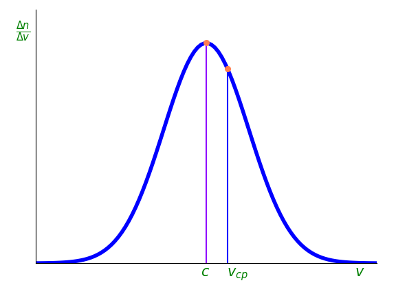

# КОМПЬЮТЕРНОЕ МОДЕЛИРОВАНИЕ МОЛЕКУЛЯРНО-КИНЕТИЧЕСКИХ ПРОЦЕССОВ

## Содержание

+ [ВВЕДЕНИЕ](#введение)
+ [ГЛАВА 1. ОПИСАНИЕ МОДЕЛИРУЕМЫХ ФИЗИЧЕСКИХ ЯВЛЕНИЙ](#глава-1-описание-моделируемых-физических-явлений)
  + [1.1 Распределение Максвелла-Больцмана](#11-распределение-максвелла-больцмана)
  + [1.2 Распределение Максвелла](#12-распределение-максвелла)
  + [1.3 Броуновское движение](#13-броуновское-движение)
+ [ГЛАВА 2. ИСПОЛЬЗУЕМЫЕ МОДУЛИ](#глава-2-используемые-модули)
  + [2.1 Компьютерное моделирование и языки программирования](#21-компьютерное-моделирование-и-языки-программирования)
  + [2.2 JavaScript и Canvas](#22-javascript-и-сanvas)
  + [2.3 Python и модули для визуализации данных](#23-python-и-модули-для-визуализации-данных)
+ [ГЛАВА 3. ОПИСАНИЕ ПРОЦЕССА МОДЕЛИРОВАНИЯ](#глава-3-описание-процесса-моделирования)
  + [3.1 Моделироваание распределения частиц в поле силы тяжести](#31-моделироваание-распределения-частиц-в-поле-силы-тяжести)
  + [3.2 Моделирование броуновского движения](#32-моделирование-броуновского-движения)
  + [3.3 Моделирование распределения молекул по скоростям](#33-моделирование-распределения-молекул-по-скоростям)
  + [3.4 Результаты моделирования](#34-результаты-моделирования)
+ [ЗАКЛЮЧЕНИЕ](#заключение)
+ [СПИСОК ИСПОЛЬЗОВАННЫХ ИСТОЧНИКОВ](#список-использованных-источников)

## ВВЕДЕНИЕ

Компьютерное моделирование – это процесс создания математических моделей реальных систем с использованием компьютерных программ. Оно позволяет исследовать поведение и изменения объектов в различных условиях, а также предсказывать их будущее поведение. Компьютерное моделирование широко используется в науке, инженерии, экономике, медицине и других областях. В настоящее время компьютерное моделирование физических процессов является одним из самых важных инструментов в научных и технических исследованиях. С его помощью можно проводить эксперименты, которые были бы невозможны или слишком дорогостоящими в реальном мире. Кроме того, моделирование позволяет ускорить процесс разработки новых технологий и устройств, а также оптимизировать уже существующие.

Цель данного дипломного проекта заключается в изучении основных методов компьютерного моделирования физических процессов и их применении на практике. Для достижения этой цели будут использованы различные программные средства. В работе будет рассмотрено моделирование различных физических процессов, включая распределение Максвелла-Больцмана, распределение частиц в поле силы тяжести, броуновское движение.

## ГЛАВА 1. ОПИСАНИЕ МОДЕЛИРУЕМЫХ ФИЗИЧЕСКИХ ЯВЛЕНИЙ

### 1.1 Распределение Максвелла-Больцмана

Если система находится в состоянии равновесия, то средние занчения любых ее параметров не будут зависеть от времени. Поэтому функция распределения должна зависеть только от интегралов движения системы. Основным интегралом движения является полная механическая энергия системы $E$ или функция Гамильтона $H$. Соответсвенно простейший общий вид функции распределения будет $w(x)=w(H)$. Конкретный же вид этой функции $w(H)$ нужно определить. Функция Гамильтона зависит от $6N$ переменных системы $x$ и от внешних параметров $a$, т. е. $H(x,a)$.

Для идеального газа функцию  Гамильтона $H(x,a)$ можно просто заменить энергией $E(x)$, тогда по формуле канонического распределения Гиббса для изотермической системы

$$w(x)=e^{\frac{\psi - H(x, a)}{\theta}} \quad (1.1.1)$$

вероятность нахождения системы с энергией $E$ в элементе фазового пространства $(dx)^{6N}$ будет

$$dW(x)=e^{\frac{\psi - E}{\theta}}=const \quad e^{-\frac{E}{kT}}(dx)^{6N}. \quad (1.1.2)$$

Для системы невзаимодействующих частиц энергию $E$ можно представить как сумму энегий отдельных частиц $E=\sum_{i=1}^{N} E_i$. Тогда вероятность (1.1.1) можно разбить на $N$ сомножителей

$$dW(x)=const \quad e^{-\frac{E_i}{kT}}dx_1dy_1dz_1dp_{x_1}dp_{y_1}dp_{z_1}...$$

$$...e^{-\frac{E_N}{kT}}dx_Ndy_Ndz_Ndp_{x_N}dp_{y_N}dp_{z_N}. \quad (1.1.3)$$

Интегрируя по $6(N-1)$ переменной всех частиц, кроме $i$-й, получим выражение вероятностей для $i$-й частицы:

$$dW(x_i,y_i,z_ip_{xi}p_{yi}p_{zi})=const \quad e^{-\frac{E_i}{kT}}dx_idy_idz_idp_{x_i}dp_{y_i}dp_{z_i} \quad (1.1.4)$$

Здесь $E_i$ рассматривается как функция $6$ переменных $p_{x_i}$, $p_{y_i}$, $p_{z_i}$, $x_i$, $y_i$, $z_i$. Распределение (1.2.4) можно рассматривать в $6$-мерном фазовом пространстве одной молекулы, которое называют $\mu$-пространством ($\mu - $от слова молекула).

Энергия отдельной частицы $E_i$ может быть представлена суммой кинетической и потенциальной энергий, зависящих от импульса и координат частицы, соответственно:

$$E=E_{кин}+E_{пот}=\frac{p_{x}^2+p_{y}^2+p_{z}^2}{2m}+ U(x,y,z)\quad (1.1.5)$$

Подставляя это выражение в (1.1.4), получим

$$dW(p_x,p_y,p_z, x,y,z)=const \quad e^{-\frac{\frac{p_{x}^2+p_{y}^2+p_{z}^2}{2m}+ U(x,y,z)}{kT}}dp_xdp_ydp_zdxdydz. \quad (1.1.6)$$

Это и есть распределение Максвелла — Больцмана.

Тот факт, что кинетическая и потенциальная энергии зависят от разных переменных, дает возможность рас­смотреть одно распределение (1.1.6) как два независи­мых распределения в трехмерном пространстве импуль­сов и в трехмерном пространстве координат:

$$dW(p_x,p_y,p_z)=Ae^{-\frac{p_{x}^2+p_{y}^2+p_{z}^2}{2mkT}}dp_xdp_ydp_z, \quad (1.1.7)$$

$$dW(x,y,z)=Be^{-\frac{U(x,y,z)}{kT}}dxdydz. \quad (1.1.8)$$

Здесь $А$ и $В$ $—$ постоянные, определяемые из условия нормировки распределений.

Функция распределения по координатам частицы (1.1.8) в потенциальном поле представляет так называе­мое распределение Больцмана (1877 г.).

$$dW(z)=Be^{-\frac{U(z)}{kT}}dz. \quad (1.1.9)$$

Для идеального газа в однородном поле силы тяжес­ти из (1.1.9) выводится известная барометрическая фор­мула. Действительно, в этом слу­чае $U(z)=mgz$ и функция рас­пределения частиц по высоте $z=h$ принимает вид

$$f(z)=\frac{dW(z)}{dz}=Be^{-\frac{mgz}{kT}}. \quad (1.1.10)$$

Вследствие пропорционально­сти числа частиц n(z) функции распределения (1.1.10) получим следующее распределение числа частиц в единице объема по вы­соте $z$:

$$n(z)=const \quad e^{-\frac{mgz}{kT}}.$$

Поскольку при $z=0$ в единице объема будет $n_0$ частиц, то для распределения частиц по высоте получим

$$n(z)= n_0 e^{-\frac{mgz}{kT}}. \quad (1.1.11)$$

Если учесть, что в газе давле­ние пропорционально плотности, то из (1.1.11) получается баромет­ рическая формула

$$\rho(z)= \rho_0 e^{-\frac{mgz}{kT}}. \quad (1.1.12)$$

Экспериментальные исследования показали, что на больших высотах в атмосфере наблюдаются отклонения числа частиц от распределения, описываемого формулой (1.1.11), связанные с неоднородным составом атмосферы, с различием температур на разных высотах и с тем, что атмосфера не находится в состоянии равновесия.
В атмосферах планет происходит явление рассеяния атмосферы в космическое пространство. Оно объясняется тем, что всякая частица, имеющая скорость больше вто­рой космической для данной планеты, может покинуть атмосферу планеты. В газе, как следует из максвеллов­ского распределения, всегда имеется некоторая доля мо­лекул с очень большими скоростями, уход которых и оп­ределяет постепенное рассеяние верхних слоев атмосфе­ры. Рассеяние атмосферы планет происходит тем быст­рее, чем меньше масса планеты и выше ее температура.

Для Земли этот эффект оказывается ничтожно малым, а планета Меркурий и Луна уже потеряли таким спосо­бом свои атмосферы.

<p align="center">

</p>
<p align="center">Рис. 3.2.1. Распределение Максвелла</p>

### 1.2 Распределение Максвелла


### 1.3 Броуновское движение

Молекулярное движение приводит к диффузии, к проникновению молекул одного газа в другой.

Пусть вдоль оси $Oz$ имется градиент концетрации некоторого примесного газа в основном газе. Тогда через едничную площадку в единицу времени снизу перемещается больше молекул диффундирующего газа, а сверху (где концетрация ниже) $-$ меньше. Таким образом, возникает направленный поток газа снизу вверх. Поток газа, вызванный диффузией, удовлетворяет закону Фика
$$ I = D\frac{dc}{dz}, \quad (1.3.1)$$

где $D$ $-$ коэффициент диффузии.

Для вычисления этого коэффициента рассмотрим диффузионный поток газа. Снизу вверх в слой $z$ через единичную площадку за время $dt$  проходит $\frac{\overline{v}n_1dtS}{6}$ молекул диффундирующего газа, а сверху из слоя $z+l$ вниз $- \frac{\overline{v}n_2dtS}{6}$ молекул.

Из самого слоя $z$ в слои $z+l$ и $z-l$ уходит $\frac{\overline{v}n_0dtS}{3}$ молекул. Разность этих велечин дает число молекул, перемещающихся за время $dt$ через площадку $S$ в направлении от слоя $z-l$ к слою $z+l$;
$$dn = \frac{\overline{v}Sdt}{6}(n_2+n_1-2n_0).$$

Здесь $n_1$, $n_0$ и $n_2 -$ среднее число молекул в слоях $z+l$, $z$ и $z-l$, отстоящих друг от друга на расстоянии $l$ и отличающихся по числу молекул на $\Delta n = \frac{dc}{dz}l$.

Поток частиц от слоя с большей концетрацией к слою с меньшей концетрацией равен
$$l=\frac{\Delta n}{S \Delta t}= \frac{\overline{v}S\Delta t}{6S \Delta t} \cdot 2 \cdot \frac{dc}{dz}l= \frac{\overline{v}l}{3} \frac{dc}{dz}. \quad (1.3.2)$$

А следовательно коэффициент диффузии определится соотношением
$$D=\frac{l}{\frac{dc}{dz}}= \frac{\overline{v}l}{3}. \quad (1.3.3)$$

Здесь $\overline{v} - $ средняя скорость молекул, считается независящей от концетрации и $l - $ средняя длина свободного пробега. Коэффициент диффузии, таким образом, оказывается $\overline{v}$ и от давления или плотности газа через $l$.

Эта формула для коэффициента диффузии с учетом выражения длины свободного пробега часто используется для оценки эффективного диаметра (размеров) молекул $d_0$.

Броуновское движение — непрерывное, беспорядочное движение малых частиц, взвешенных в жидкости или газе, происходящее под действием ударов молекул окружающей среды. Броуновское движение представляет собой одно из наиболее ярких и доступных наблюдению проявлений молекулярно-кинетической природы хаотического теплового движения атомов и молекул. [1]
Причина броуновского движения — тепловое движение молекул среды и отсутствие точной компенсации ударов, испытываемых частицей со стороны окружающих её молекул, т. е. броуновское движение обусловлено флуктуациями давления (флуктуации — это случайные отклонения физических величин от их средних значений). Эти флуктуации в числе ударов $\Delta n$ по статистическим законам пропорциональны $\frac{1}{\sqrt{n}}$. Поэтому, если частица большая, т. е. с ней сталкивается одновременно большое число молекул $n$, то флуктуации $\Delta n$ будут очень малы и большая частица не придет в движение. Если частица имеет микроскопические размеры, то число столкновений $n$ будет невелико, а флуктуации $\Delta n$ большие. Благодаря флуктуациям происходит необратимое перемещение броуновкой частицы.

Хотя броуновская частица движется в результате хаотических столкновений с молекулами среды и невозможно точно определить ее траекторию, статистические методы позволяют определить среднее квадратичное отклонение частицы от начального положения как функцию времени. Найдем закон движения броуновской частицы в среде с коэффициентом вязкости $\eta$.

Уравнение движения броуновской частицы имеет вид
$$M\ddot{r} = R(t) - 6 \pi \eta ar. \quad (1.3.4)$$

Здесь $M -$ масса частицы, $r -$ ее радиус-вектор, $6\pi \eta ar -$ вязкая сила, действующая на частицу, имеющую скорость $r$ и радиус $a$, и наконец $R(t) -$ мгновенная равнодействующая всех сил ударов молекул о частицу. Умножим уравнение (1.3.4) скалярно на $r$:
$$M(\ddot{r}r)= rR(t)- 6\pi \eta a(\dot{r} r) \quad (1.3.5) $$

и воспользовавшиь вспомогательными соотношениями

$$(\dot{r}r)=\frac{1}{2} \cdot \frac{d^2}{dt^2}(r^2)- r^2, $$

перепишем уравнение (1.3.5) в виде
$$ M \frac{d^2}{dt^2}\left(\frac{r^2}{2}\right) + 6 \pi \eta a \frac{d}{dt}\left( \frac{r^2}{2}\right) = M\dot{r}^2 + rR(t).$$

Проинтегрируем последнее уравнение один раз по времени и рахделим почленно на t:

$$\frac{M}{t} \cdot \frac{d}{dt}\left(\frac{r^2}{2}\right) + \frac{6 \pi }{t} \eta a\left( \frac{r^2}{2}\right)=\frac{1}{t} \int_{0}^{1}Mr^2\,dt + \frac{1}{t}\int_{0}^{1}rR(t)\,dt. \quad (1.3.6)$$

Найдем значения выражений, стоящих в правой части. Первый член представляет удвоенную среднюю кинетическую энергию частицы за промежуток времени от0 до $t$. Так как благодаря столкновениям молекулы среды и броуновская частица непрерывно обмениваются энергией, то на одну степень свободы частицы в среднем приходится энергия $\frac{kT}{2}$. Поскольку в поле микроскопа мы рассматриваем движение частицы в плоскости, т. е. с двумя степенями свободы, то кинетическая энергия плоского движения будет равна $kT$, т. е.
$$\frac{1}{t} \int_{0}^{1} M\dot{r}^2 \, dt = 2kT.$$

Второй член есть среднее значение произведения $r(t)R(t)$ за тот же интервал времени. Вследствие хаотичности движения частицы и действующих на частицу сил оно равно нулю:

$$ \frac{1}{t}\int_{0}^{1}r(t)R(t) \, dt = 0.$$

Поэтому уравнение (1.3.6) можно переписать так:

$$\frac{M}{t}\frac{d}{dt}\left(\frac{r^2}{2}\right) + \frac{6\pi a\eta}{t}\left(\frac{r^2}{2}\right) =2kT. \quad (1.3.7)$$

Вводя переменную $z=r^2$, получаем линейное уравнение

$$M\dot{z} + 6 \pi a \eta z = 4kTt, \quad (1.3.8) $$

решением которого является сумма общего решения однородного уравнения и частное решение неоднородного. Решение однородного уравнения имееет вид:

$$z_{одн} = Ce^{-\frac{6\pi a \eta t}{M}} \quad (1.3.9)$$

и для больших интервалов времени обращается в нуль. Частное решение неоднородного уравнения ищем в виде

$$z_{неодн}=At.$$

Подставляя его в (1.2.8), получаем выражение для $A$:
$$A = \frac{4kTt}{6\pi \eta t + M}.$$

Пренебрегая в знаменателе массой $M$, для больших промежутков времени ($t  \rightarrow \infty$) получим

$$z_{неодн}=\frac{4kT}{6 \pi a \eta}t=\frac{2kTt}{3 \pi a \eta}. \quad (1.3.10)$$

Таким образом, решением уравнения движения броуновской частицы за большие промежутки времени, когда $r^2$ можно считать за средний квадрат смещения частицы в плоскости $\overline{r^2}$, будет выражение

$$r^2 = \overline{r^2}=2\frac{kT}{3 \pi a \eta}t. \quad (1.3.11)
$$

Формула (1.3.11) называется формулой Эйнштейна$-$Смолуховского. Она показывает, что среднее квадратичное смещение броуновской частицы $\sqrt{\overline{r^2}}$ зависит от температуры и вязкости среды, размеров частиц и пропорционально корню квадратному из времени наблюдения.

Далее, заменяя $\frac{kT}{3 \pi a \eta}$ коэффициентом диффузии $D$, для среднего квадрата смещения $\overline{r^2}$ броуновской частицы за время $t$  получаем выражение

$$\overline{r^2}=2Dt. \quad (1.3.12)$$

Смещения отдельных броуновских частиц в плоскости от начального положения являются случайными величинами и будут распределяться около среднего квадратичного смещения по гауссовскому закону. Вероятность того, что частица за время $t$ сместится на расстояние $x$ от начального положения равна

$$dW(x)=Ae^{-\frac{x^2}{2\overline{r^2}}}dx.$$

По аналогии запишем

$$dW(y)=Ae^{\frac{y^2}{2\overline{r^2}}}dy.$$

Вероятность смещения в плоскости на расстояние $r$

$$dW(r)=A^2e^{-\frac{x^2}{2r^2}}dy=2 \pi A^2e^{-\frac{r^2}{2\overline{r^2}}}rdr. \quad (1.3.13)$$

Последняя формула хорошо удовлетворяется на опыте.

## ГЛАВА 2. ИСПОЛЬЗУЕМЫЕ МОДУЛИ

### 2.1 Компьютерное моделирование и языки программирования

Одним из наиболее распространенных языков программирования для моделирования является MATLAB. Этот язык используется для решения математических задач, анализа данных и создания графиков. MATLAB имеет большое количество встроенных функций и инструментов для работы с матрицами и векторами, что делает его очень удобным для создания математических моделей.

Другим популярным языком программирования для компьютерного моделирования является Python. Python – это интерпретируемый язык программирования, который используется для разработки программного обеспечения, анализа данных и машинного обучения. Он имеет простой и понятный синтаксис, что делает его доступным для начинающих программистов. Также можно выделить C++, C#, Java, JavaScript и др. Каждый из этих языков имеет свои преимущества и недостатки в зависимости от задачи, которую нужно решить.

Кроме языков программирования, для компьютерного моделирования используются специализированные программные средства, такие как Simulink, ANSYS, COMSOL и др. Эти программы предоставляют готовые блоки для создания математических моделей и имеют широкий набор инструментов для анализа результатов моделирования.

### 2.2 JavaScript и Canvas

```JavaScript``` $-$ это язык программирования, который широко используется для создания интерактивных веб-страниц. Одним из самых популярных приложений JavaScript является создание графики и анимации в вебе с использованием технологии Canvas.

```Canvas``` - это мощный элемент HTML5, который позволяет разработчикам создавать динамическую, интерактивную графику на веб-страницах. С помощью Canvas можно рисовать фигуры, линии, текст и изображения, а также анимировать их в реальном времени. Это делает его идеальным инструментом для создания игр, диаграмм, визуализаций данных и других интерактивных веб-приложений.

Одним из ключевых преимуществ использования Canvas с JavaScript является то, что он позволяет быстро и плавно отображать графику, даже на мобильных устройствах. Это происходит потому, что Canvas использует аппаратное ускорение для рендеринга графики, что означает, что он использует GPU (графический процессор) устройства для выполнения вычислений и быстрого рисования графики.

### 2.3 Python и модули для визуализации данных

Для написания программ используются ```Python 3.11.2``` с пакетами ```Pygame```,```Pymunk```, ```random```, ```Matplotlib``` и ```Numpy```.

```Python``` — высокоуровневый язык программирования общего назначения с динамической строгой типизацией и автоматическим управлением памятью, ориентированный на повышение производительности разработчика, читаемости кода и его качества, а также на обеспечение переносимости написанных на нём программ. Язык является полностью объектно-ориентированным в том плане, что всё является объектами. [5]

```Pygame``` — набор модулей (библиотек) языка программирования Python, предназначенный для написания компьютерных игр и мультимедиа-приложений. Pygame базируется на мультимедийной библиотеке SDL. [6]

```Pymunk``` — это физический движок для языка программирования Python, который позволяет создавать физические симуляции, такие как игры или моделирование движения объектов. Он предоставляет различные функции для работы с твердыми телами, силами, столкновениями и т.д. [7]

```random``` $-$ это модуль языка программирования Python, который предоставляет функции для генерации случайных чисел. Он может использоваться для создания случайных чисел, выборки случайных элементов из списка, перемешивания списка и т.д. Python random использует различные алгоритмы для генерации чисел, включая алгоритм Mersenne Twister. [5]

Для моделирования частиц в программе используется ```matplotlib.patches```.

```matplotlib.patches``` $-$ это модуль библиотеки Matplotlib для создания графических объектов (патчей) на графике. Он содержит классы для создания различных типов патчей, таких как прямоугольники, круги, многоугольники и т.д. [8]

Класс ```ParticlePatch``` в модуле matplotlib.patches используется для создания патчей, представляющих частицы в системах. Он позволяет задавать различные параметры частиц, такие как размер, цвет и положение на графике.

ParticlePatch может быть полезен в различных областях, таких как физика, химия и материаловедение, где важно визуализировать системы частиц и их поведение на графике.

## ГЛАВА 3. ОПИСАНИЕ ПРОЦЕССА МОДЕЛИРОВАНИЯ

### 3.1 Моделироваание распределения частиц в поле силы тяжести

Моделирование реализовано на языке прграммирвания ```JavaScript``` и элементом HTML5 ```Canvas```

Для работы с ```Canvas``` необходимо сперва задать тег в ```html``` документе.

```Html
<canvas id="canvas" width="700" height="700"></canvas>
```

Затем в ```JavaScript``` коде получить поле для рисования

```JavaScript
var canvas = document.getElementById('canvas');
var context = canvas.getContext('2d');
```

Параметры для описания частицы (радиус, цвет, масса, заряд, градиент) в данной модели определены в классе ```Ball```.
В целом анимация происходит следующим образом: функция ```Init()``` создает и инициализирует ```Ball object``` , задавая его положение и скорость, после чего отрисовывает его в поле ```canvas```. Дальше инициализируются переменные времени и вызывается функция ```animFrame()```, которая настраивает цикл анимации и вызывает ```onTimer()``` и ```move()``` . Функция ```onTimer()```  вычисляет прошедшее время (в секундах) с момента первого вызова, $dt$, а затем обновляет продолжительность времени от начала симуляции, $t$ (в секундах). Последнее вычисляется путем суммирования всех пройденных временных интервалов $dt$ до текущего момента. Функция ```onTimer()``` также содержит условный оператор, который вызывает функцию ```move()```, если общее время симуляции меньше заданной продолжительности ```animTime```, и вызывает функцию ```stop()``` в противном случае, которая завершает цикл анимации. Функция ```move()``` обновляет вектор позиции ```Ball object``` на основе вектора скорости, удаляет все в ```canvas``` и перерисовывает ```Ball object```. [2]
Наличие столкновений между парами частиц в массиве проверяются в ```checkCollision()```. Для этого мы используем
```Vector2D.distance(vec1,vec2)``` статический метод, который вычисляет расстояние между двумя точками с
помощью векторов положения ```vec1``` и ```vec2```. Логика алгоритма обнаружения столкновений проста: если расстояние между центрами
двух частиц меньше или равно сумме их радиусов, это означает, что они столкнулись. Затем мы меняем местами скорости
двух частиц. [2]

### 3.2 Моделирование броуновского движения

Моделирование осуществляется с помощью ```Pygame``` и ```Pymunk```.

Параметры атомов описаны в классе ```Atom```. Данный класс имеет такие поля как радиус, скорость, масса, плотность, упругость, форму, начальную позицию и координаты.

```Python
class Atom():
    def __init__(self,x,y):
        self.x=x
        self.y=y
        self.mass=1
        self.radius=8
        self.moment=pymunk.moment_for_circle(self.mass,0,self.radius)
        self.body=pymunk.Body(self.mass,self.moment)
        self.body.position=x,y
        self.body.velocity=random.uniform(-100,100),random.uniform(-100,100)
        self.shape=pymunk.Circle(self.body,self.radius)
        self.shape.density=1
        self.shape.elasticity=1
        space.add(self.body,self.shape)
```

Класс имеет один метод, который в качестве параметра принимает объект класса ```Atom``` и с помощью его координат с радиусом  рисует фигуру на поверхности.

Отрисовка производится посредством встроенного в Pygame метода ```draw.circle()```.

```Python
def draw(self):
    x,y=self.body.position
    pygame.draw.circle(display,PURPLE,(int(x),int(y)),self.radius)
```

Модель частицы описана в классе ```Particle```, который идентичен классу ```Atom```. Отличие двух классов заключается в значениях таких полей как радиус, масса, скорость и плотность. Здесь также присутствует метод класса ```draw()```, который принимает в качестве параметра объект класса ```Particle```.
Классы описывают модель одного атома или частицы вещества. Но нам нужно, чтобы этих частиц было много и вообще для начала их создать.
Данный процесс происходит в функции ```game()```, в которой создаются объекты всех вышеперечисленных классов, а также в функции ```game()``` находится главный цикл, который будет вызывать все методы для отрисовки физических объектов.
Функция ```game()``` не принимает никаких параметров на входе. В её реализации прописано создание списков объектов классов ```Atom```, ```Particle``` и ```Wall```. Списки генерируются с помощью механизма языка ```Python list comprehension```. Это нужно, чтобы происходила отрисовка не одной, а множества частиц на экране.

```Python
def game():
    atoms=[Atom(random.randint(0,800),random.randint(0,800)) for i in range(450)]
    particles=[Particle(random.randint(0,800),random.randint(0,800)) for i in range(5)]
    walls=[Wall((0,0),(0,800)),
    Wall((0,0),(800,0)),
            Wall((0,800),(800,800)),
            Wall((800,0),(800,800))]
    while True:
        for event in pygame.event.get():
        if event.type==pygame.QUIT:
           exit()

        display.fill((0,0,0))
        for atom in atoms:
            atom.draw()
            for particle in particles:
                particle.draw()

        pygame.display.update()
        clock.tick(FPS)
        space.step(1/FPS)
```

### 3.3 Моделирование распределения молекул по скоростям

Программа моделирует систему частиц и анимированную гистограмму распределения их скоростей, используя модули ```matplotlib``` и ```numpy```.

В Matplotlib гистограмма представлена как набор прямоугольников (столбцов), патчами (patches). Каждый патч представляет собой один столбец гистограммы и имеет свои свойства, такие как цвет, прозрачность и т.д.

Класс ```matplotlib.hist.patch``` используется для создания и настройки патчей гистограммы. Он содержит методы для установки свойств патча, таких как ```set_facecolor()``` для установки цвета заполнения патча, ```set_alpha()``` для установки прозрачности и т.д.

В данной программе гистограмма и ее параметры описаны в классе ```Histogram```, который отрисовывает гистограмму как коллекцию патчей.

В файле ```main.py``` настраиватеся окно вывода Matplotlib.

```Python
DPI = 100
width, height = 1000, 500
fig = plt.figure(figsize=(width/DPI, height/DPI), dpi=DPI)
fig.subplots_adjust(left=0, right=0.97)
sim_ax = fig.add_subplot(121, aspect='equal', autoscale_on=False)
sim_ax.set_xticks([])
sim_ax.set_yticks([])
speed_ax = fig.add_subplot(122)
speed_ax.set_xlabel('Speed $v\,/m\,s^{-1}$')
speed_ax.set_ylabel('$f(v)$')
```

Задаются число, масса частиц, а также случайным образом выбирается их начальное положение

```Python
n = 250
m = 1
pos = np.random.random((n, 2))
```

Вышеперечисленные параметры передаются в инициализатор класса ```MDSimulation```

```Python
 def __init__(self, pos, vel, r, m):
        self.pos = np.asarray(pos, dtype=float)
        self.vel = np.asarray(vel, dtype=float)
        self.n = self.pos.shape[0]
        self.r = r
        self.m = m
```

Класс ```MDSimulation``` просчитывает столкновения частиц друг с другом и со стенками сосуда. Метод  ```def advance()``` обновляет позицию частиц в соответствии с их скоростями.

Анимацию в Matplotlib удобно осуществлять с помощью ```FuncAnimation()```.

```Python
frames = 800
anim = FuncAnimation(fig, animate, frames=frames, interval=45, init_func=init_anim)
```

```FuncAnimation()``` для анимации необходимы

```Python
fig       #объект, фигура на которой будет производиться отрисовка
animate() #функция, которая будет вызываться для каждого кадра
frames    #количество кадров
interval  #задержка между кадрами в мс
init_func #функция для отрисовки четкого кадра
```

Если ```init_func``` не указана, будут использованы результаты рисования из первого элемента в последовательности кадров.

### 3.4 Результаты моделирования

Распределение частиц в поле силы тяжести:

<p align="center">

</p>

Броуновское движение:

<p align="center">

</p>

Распределение молекул по скоростям:

<p align="center">

</p>

## ЗАКЛЮЧЕНИЕ

В заключение можно сказать, что создание компьютерной модели является важным инструментом для исследования различных физических явлений. В данном дипломном проекте были рассмотрены три симуляции: броуновское движение, распределение молекул по скоростям и распределение частиц в поле тяжести.

Броуновское движение является одним из наиболее изученных явлений в физике. С помощью компьютерной модели удалось продемонстрировать, как частицы движутся в случайном порядке, что позволяет лучше понять механизмы этого явления.

Распределение молекул по скоростям является важным параметром в химии и физике. С помощью компьютерной модели удалось проанализировать, как изменяется распределение молекул при изменении температуры и других параметров.

Распределение частиц в поле тяжести также является важным явлением в физике. С помощью компьютерной модели удалось продемонстрировать, как частицы распределяются в поле тяжести, что позволяет лучше понять механизмы этого явления.

Таким образом, создание компьютерной модели является важным инструментом для исследования различных физических явлений. Разработанные симуляции позволяют лучше понимать механизмы броуновского движения, распределения молекул по скоростям и распределения частиц в поле тяжести.

## СПИСОК ИСПОЛЬЗОВАННЫХ ИСТОЧНИКОВ

1. Китайгородский А. И. Введение в физику / А. И. Китайгородский. $-$ 1973. $-$ P. 174 $-$ 180.
2. Ramtal, D. Dobre, A. Physics for JavaScript Games, Animation, and Simulations / D. Ramtal, A. Dobre. $-$ 1st Ed. $-$ 2014. $-$ P. 109 $-$ 209.
3. JavaScript documentation [Electronic resource]. $-$ Mode of access: [https://developer.mozilla.org/en-US/docs/Web/JavaScript](https://developer.mozilla.org/en-US/docs/Web/JavaScript). Date of access: 12.01.2023.
4. Canvas documentation [Electronic resource]. $-$ Mode of access: [https://developer.mozilla.org/en-US/docs/Web/API/Canvas_API/Tutorial](ttps://developer.mozilla.org/en-US/docs/Web/API/Canvas_API/Tutorial). Date of access: 12.01.2023.
5. Python documentation [Electronic resource]. $-$ Mode of access: [https://docs.python.org/3/](https://docs.python.org/3/). $-$ Date of access: 03.03.2023.
6. Pygame documentation [Electronic resource]. $-$ Mode of access: [https://www.pygame.org/](https://www.pygame.org/). $-$ Date of access: 03.03.2023.
7. Pymunk documentation [Electronic resource]. $-$ Mode of access: [http://www.pymunk.org/](http://www.pymunk.org/). $-$ Date of access: 03.03.2023.
8. Matplotlib documentation [Electronic resource]. $-$ Mode of access: [https://matplotlib.org/](https://matplotlib.org/). $-$ Date of access: 03.03.2023.
9. Numpy documentation [Electronic resource]. $-$ Mode of access: [https://numpy.org/](https://numpy.org/). $-$ Date of access: 03.03.2023.
10. The Maxwell–Boltzmann distribution in two dimensions [Electronic resource]. $-$ Mode of access: [https://scipython.com/blog/the-maxwellboltzmann-distribution-in-two-dimensions/](https://scipython.com/blog/the-maxwellboltzmann-distribution-in-two-dimensions/). $-$ Date of access: 23.03.2023.
