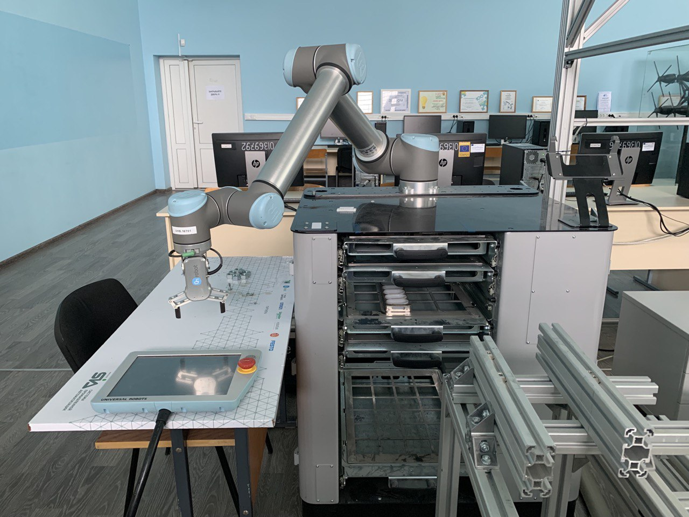
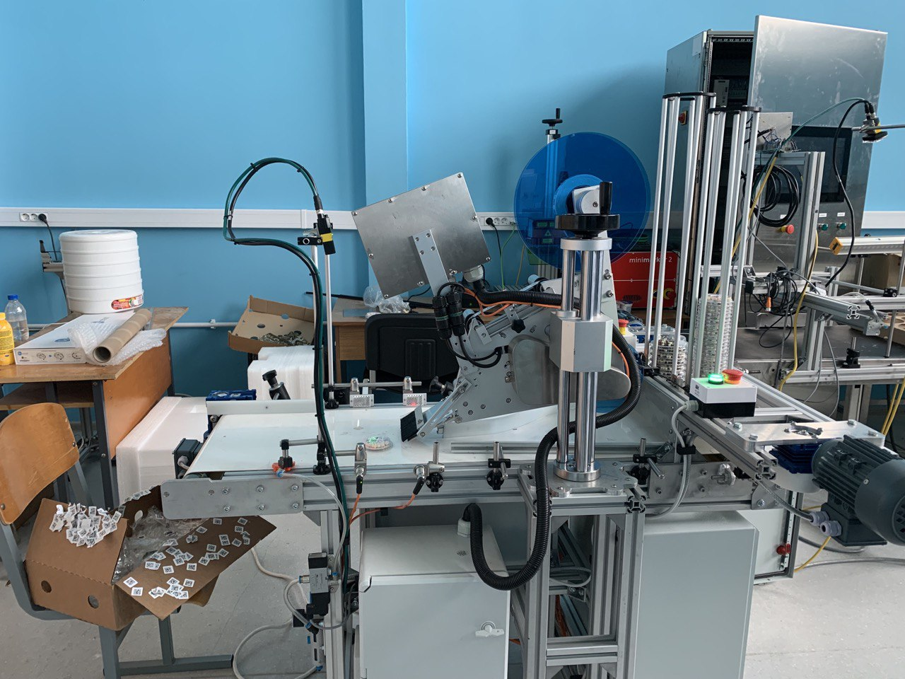
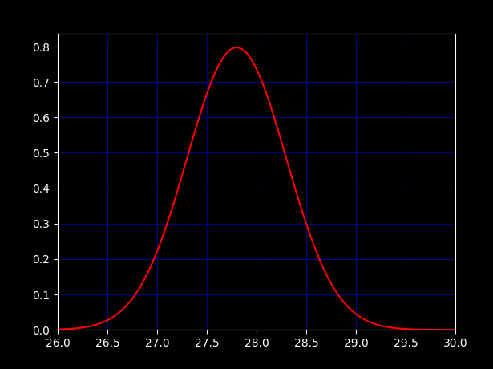

# Отчет о прохождении преддипломной производственной практики

## СОДЕРЖАНИЕ

+ [ВВЕДЕНИЕ](#введение)
+ [ОСНОВНАЯ ЧАСТЬ](#основная-часть)
  + [Знакомство с основными задачами отдела программирования](#знакомство-с-основными-задачами-отдела-программирования)
  + [Проделанная работа](#проделанная-работа)
+ [ЗАКЛЮЧЕНИЕ](#заключение)

## ВВЕДЕНИЕ

Местом прохождения практики был выбран отдел программирования ОАО «Савушкин продукт» с 23.01.2023 г. по 13.05.2023 г.

Цель практики: ознакомиться с деятельностью предприятия, получить практический опыт работы и навыки для написания дипломной работы.

Задачи практики:

+ Сбор материала для дипломной работы по теме «Компьютерное моделирование молекулярно-кинетических процессов»
+ Получения практического опыта работы с контроллерами и аналоговыми устройствами, в частности с датчиком температуры.
+ Изучение различных библиотечных функций С++ и Python для математичесикх расчетов и визуализации данных.
+ Ознакомиться с рабочим процессом отдела программирования.
+ Оформление дипломной работы на Github c помощью языков разметки Markdown и Latex.

## ОСНОВНАЯ ЧАСТЬ

### Знакомство с основными задачами отдела программирования

«Савушкин продукт» $-$ современное хорошо автоматизированное производство. Все программное обеспечение организация разрабатывает сама.

По результатам моего опроса сотрудников одними из задач, которые решаются посредством программирования являются:

+ Разработка программного обеспечения терминала сбора данных, включая на базе ОС Android.
  + языки: C#, Kotlin
  + среда разработки: Android Studio, Visual Studio (2008)
+ Автоматизация работы отдела продаж, реализация.
  + языки: Kotlin
  + среда разработки: Android Studio
+ Разработка инструмента реализации.
  + языки: Delphi, Java, Python
  + среда разработки: Rad Studio
+ Разработка мобильного приложения для регистрации «претензий»
  + языки:  Kotlin, Java, Java Script
  + среда разработки: Android Studio
+ Разработка программного обеспечения для отслеживания грузовых машин.
  + языки: PHP, Java Script
  + среда разработки: Visual Studio Code
+ Разработка, тестирование проекта систем вентиляции и кондиционирования.
  + языки: Lua
  + среда разработки: Visual Studio Code, Eplan Electric
+ Работа со SCADA Monitor системами, разработка проекта.
  + языки: Интерпретатор Delphi
  + среда разработки:
+ Разработка программного обеспечения для работы с контроллерами.
  + языки: C, C++
  + среда разработки: Visual Studio
+ Разработка SCADA и системы маркировки.
  + языки: Delphi, C++, C#, Python, SQL
  + среда разработки: Visual Studio, Rad Studio
+ Автоматизация производства, реализация проектов.
  + языки: Delphi, C++, C#, Python, SQL
  + среда разработки: Clion, Rider, Visual Studio, VS Code
+ Разработка дополнительного программного обеспечения к Eplan (ПО для проектирования электрических систем и автоматизации производства, позволяет создавать схемы, планировать расположение оборудования, генерировать список материалов и многое другое.)
  + языки: C#
  + среда разработки: Visual Studio

В качестве системы контроля версий используется Git, иногда с графическом интерфейсом GitKraken.

В лаборатории «Савушкин продукт» на базе БрГТУ ведется работа над техническим зрением, которое позволяет автоматически отбраковывать некачественные товары, работа с роботами манипуляторами и контроллерами, а также рассматриваются перспективы и возможности внедрения электронных цен в магазины.

<p align="center">
 </p>
<p align="center"> Рис. 2. Робот манипулятор </p>
<p align="center">

<p align="center">
 </p>
<p align="center"> Рис. 3. Установка для работы с техническим зрением </p>

### Проделанная работа

В ходе практики мне довелось заниматься сборкой и запуском проекта на контроллере исходники которого лежат [здесь](https://github.com/savushkin-r-d/T1-PLCnext-Demo), а также обновлением устаревшей документации с помощью Markdown. После запуска данная программа позволяла считывать данные с датчика температуры.

Моим главным заданием на практике было сделать симуляцию датчика температуры при запуске [проекта](https://github.com/savushkin-r-d/ptusa_main) в режиме эмуляции. То есть программа должна делать вид, что она подключена к контроллеру и считывает данные температуры. Значения температуры должны соответствовать нормальному распределению.

<p align="center">
 </p>
<p align="center"> Рис. 1. График нормального распределения </p>

Для этого мне нужно было разобраться в иерархии классов проекта ```ptusa_main```, изменить функцию получения значений температуры ```get_value()```, написать свой класс ```analog_emulator```, ответственный за возврат значений аналоговых устройств в режиме эмуляции, у которого есть собственный метод ```get_value()```, а затем все это протестировать средствами googletest и github actions. Все это делолось на языке программирования C++, 11 стандарта. Проект кроссплатформенный и собирается на CMake. Генерацией чисел, которые соответствуют нормальному распределению занималась функция STL ```std::normal_distribution```. Данной функции передаются в качестве параметров мат. ожидание и стандартное отклонение, в программе предусмотрена возможность также в дальнейшем модифицировать эти параметры. Более подробно все изложено в написанном мною [user_manual](https://github.com/NogameNo-life/ptusa_main/tree/dev_manual/docs/user_manual). Это краткая документация к моему заданию.

В тестах проверялась правильность инициализации членов класса в конструкторе, работа метода для модификации параметров  в ```std::normal_distribution```.

## ЗАКЛЮЧЕНИЕ

Во время прохождения практики я:

+ улучшила свои навыки работы с Git
+ получила опыт работы с реальным проектом
+ научилась писать документацию к проекту
+ научилась cобирать и подключать библиотеки к проекту с помощью CMake
+ изучила материалы и документацию (Matplotlib, Canvas) необходимые для написания дипломной работы
+ написала публикации по теме дипломной, не без помощи ChatGPT, чтобы получить хотя бы 10 за диплом, т. е. работа с нейросетью
+ посетила лаборатории «Савушкин продукт» в Политехническом университете
